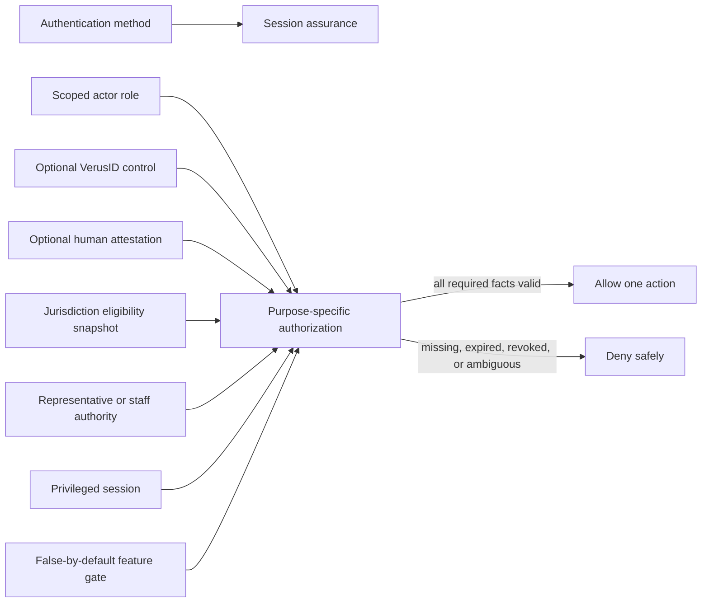
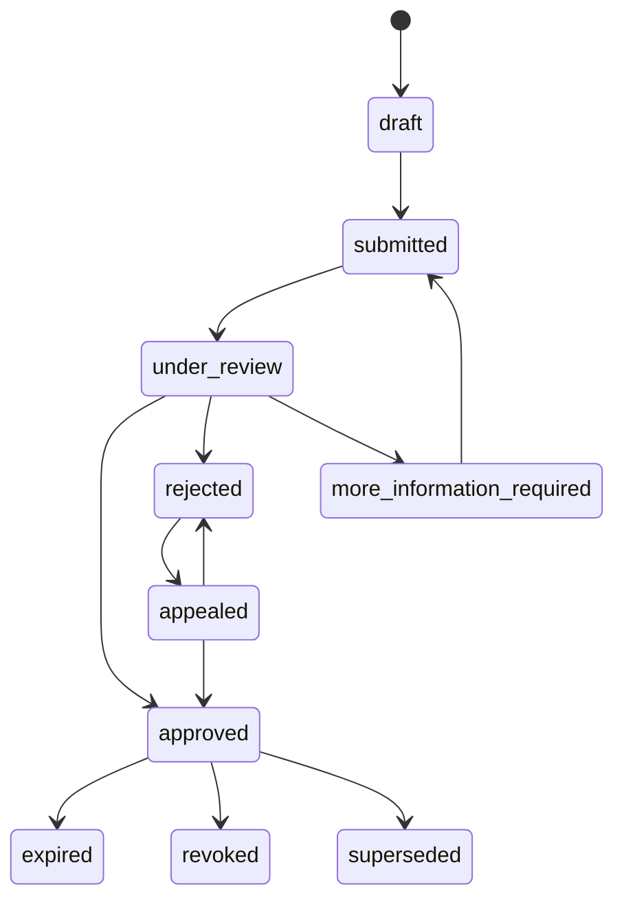
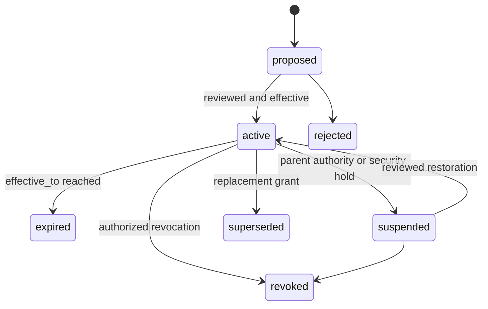
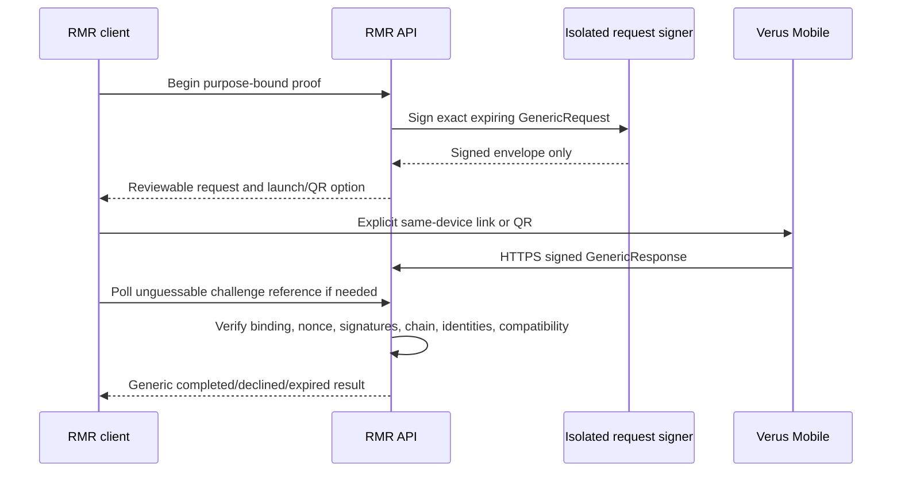

# Authentication, Identity, Authority, and Attestation Policy

**Status:** Accepted issue #3 policy baseline; sensitive workflows remain disabled
**Version:** `rmr-auth-identity-policy.v1`
**Issue:** [#3](https://github.com/constitutionalmoney/rate-my-representatives-app/issues/3)
**Requirements:** FR-AUTH-001 through FR-AUTH-007 and FR-VID-001 through FR-VID-007
**Last updated:** 2026-08-09

## 1. Purpose and implementation status

This document defines the security and governance policy for RMR accounts, actor roles,
representative authority, optional VerusID links, human attestations, jurisdiction
eligibility, sessions, recovery, consent, and revocation. It extends the synthetic issue
#12 core in [`AUTH_SECURITY_FOUNDATION.md`](./AUTH_SECURITY_FOUNDATION.md), the canonical
logical entities in [`DATA_MODEL.md`](./DATA_MODEL.md), and the wallet boundary in
[`IDENTITY_AND_VERUS_MOBILE.md`](./IDENTITY_AND_VERUS_MOBILE.md).

The policy is not a claim that these sensitive workflows are deployed:

| Capability | Current status after issue #3 |
| --- | --- |
| Anonymous public browsing | Implemented for the synthetic read-only application |
| Passkey/email/session/role policy and test adapters | Foundation only; in-memory and all account gates false |
| Native secure-storage and safe-link boundary | Foundation only; no authenticated native account UI |
| Representative claims and staff delegation | Planned under issue #62; false by default |
| Optional VerusID account linking/proof | Planned under issue #31; false by default |
| Human attestation provider/CBC adapter | Planned under issue #38; false by default |
| Jurisdiction eligibility and human participation | Planned; false by default |
| RMR-managed representative Verus identities/activity publication | Planned under issues #80–#83; VRSCTEST-first and false by default |
| Representative-controlled identity update | Not authorized by the current model; superseded issue #50 is closed |

Issue #3 adds documentation and regression tests only. It creates no account, identity,
attestation, eligibility, claim, delegation, wallet, or Verus persistence; no route; no
provider integration; and no chain write. All examples are synthetic.

## 2. Independent security facts

RMR must never collapse security facts into one trust or verification ladder. Each fact
answers a different question and has a separate issuer, scope, expiry, revocation path,
and audit record.

| Fact | Question answered | What it cannot prove |
| --- | --- | --- |
| Authentication method | How did this actor authenticate? | Role, humanity, locality, office, truth |
| Authentication assurance | How strongly was the current session authenticated? | Permission or eligibility |
| Actor type and role grant | What application action may this human or service attempt? | Identity evidence, public office, truth |
| VerusID control | Did a wallet prove current control of this immutable i-address for this challenge? | Uniqueness, humanity, residence, citizenship, office, truth |
| Human attestation | Did an approved provider return the minimum valid human-status result? | Locality, citizenship, voter eligibility, truth |
| Jurisdiction eligibility | Did a versioned policy evaluate this account for this specific action and office scope? | General civic worth or future eligibility |
| Representative authority | May this reviewed claimant act for this office term/candidacy and permission? | Factual correctness of the action |
| Privileged access | May this moderator or administrator use a narrow operational permission now? | A higher class of citizen or generalized trust |



No arrow means equivalence. A moderator is not a more verified participant. A Civic
Agent is a service role, never a person. Higher authentication assurance cannot create a
role, attestation, eligibility result, or public authority.

## 3. Actors and role matrix

Roles are additive, least-privilege grants, not ranks. Each grant has a stable grant ID,
actor type, scope, permission set, `effective_from`, optional `effective_to`, grant audit
reference, and independent revocation time. Permission checks evaluate the current
session, current grant, exact resource/action scope, feature gate, and any additional
purpose-specific fact.

| Actor or state | Account/authentication baseline | Permitted baseline | Additional required fact | Explicitly not implied |
| --- | --- | --- | --- | --- |
| Public visitor | None | Browse allowlisted public records | None | Account, participation, attribution |
| Basic participant | Passkey or verified email when accounts launch | Manage own account and non-consequential private preferences | Enabled account/lifecycle gate | Verified human or participation eligibility |
| Verified participant | Basic account plus approved current human attestation | Attempt a consequential human action | Separate current jurisdiction-eligibility snapshot, recent presence, action gate | Citizenship, locality from attestation alone, factual truth |
| Evidence contributor | Human account or explicitly scoped service, according to evidence policy | Submit source/context packet for review | Evidence gate, rate/abuse policy, provenance of submission | Evidence truth or priority solely from identity tier |
| Representative/candidate | Human account | Draft/submit scoped official responses or correction requests | Approved, unexpired application-local claim for exact person and office term/candidacy | Truth, current VerusID control, blanket authority |
| Authorized staff | Human account | Perform only delegated actions | Active non-transitive delegation under active representative authority | Power to redelegate or act outside office term |
| Moderator/reviewer | Human account | Assigned review decisions | Active scoped role and separate phishing-resistant privileged session | General administrator power or superior civic status |
| Administrator | Human account | Narrow operational/governance actions | Active scoped role and separate phishing-resistant privileged session | Unlogged override, identity evidence access by default, truth |
| Civic Agent/service | Service principal | Explicit research/review-draft automation only | Service scope, feature gate, accountable human review | Human intent, signal/rating/comment, wallet approval, representative response |

Human-intent commands reject service actors at both route and domain boundaries even if
a role is misconfigured. Anonymous reads and basic account recovery never depend on
Verus, a human attestation provider, or a representative identity.

## 4. Authentication and session policy

### 4.1 Public and basic account baseline

- Public browsing requires no account and no wallet.
- Basic accounts support passkeys and verified email; VerusID is never the only login
  path.
- Authentication start and recovery endpoints return enumeration-resistant responses.
- Production passkey/WebAuthn verification, email delivery, and persistence require
  reviewed adapters and separate release approval; issue #12 adapters are synthetic.
- Authentication establishes an opaque local `account_id`. Public records never expose
  the account, authenticator, session, email, or device identifier.

### 4.2 Assurance and privilege

The current assurance classes are `basic` and `phishing_resistant`. Moderator and
administrator actions require a distinct, short-lived privileged session created only
after a phishing-resistant passkey ceremony. A role grant alone, a verified email, a
human attestation, a VerusID response, or a recovered basic session cannot create that
privileged session. Re-authentication is required for high-impact account and authority
changes according to the owning policy.

### 4.3 Revocable sessions

Sessions are server-created, device-aware, hashed at rest, expiring, rotating, and
individually or globally revocable. Reuse of a rotated credential revokes its session
family. Recovery and accepted account deletion revoke all sessions before rebinding or
completion. Device labels are user-visible but remain opaque and must not become
fingerprints or precise-location records.

Web sessions use the approved `__Host-`, Secure, HttpOnly, Path=/, no-Domain,
SameSite=Lax cookie policy. State-changing cookie requests require exact-origin checks
and a session-bound synchronizer CSRF token.

Native iOS and Android session material may be stored only through the approved Keychain
or Keystore adapter. Plain application storage, logs, crash reports, analytics, URL
parameters, clipboard state, and public caches are forbidden. Sign-out, account
deletion, device compromise, session revocation, or replay response must clear the secure
vault and every private client cache.

### 4.4 Recovery and lifecycle by data class

Recovery is an authentication process, not proof of role, humanity, jurisdiction, office,
or VerusID control. A recovered actor must separately re-establish any expired or revoked
facts. Destructive or consequential requests use generic responses and retain only the
minimum evidence required by approved security and legal policy.

| Data class | Access/export | Correction | Deletion/expiry | Objection, review, and appeal |
| --- | --- | --- | --- | --- |
| `ACCT` account/authentication | Account-controlled export after strong re-authentication | Correct account fields; authenticators are replaced/revoked, not silently rewritten | Approved closure revokes sessions and deletes/pseudonymizes under policy | Security holds are narrow, explained through the approved process, and reviewable |
| `ID-P` identity/attestation/eligibility | Purpose-limited account view; never public enumeration | New immutable status/link/snapshot supersedes the prior state | Expire/revoke when no longer necessary; retain minimum approved proof | Provider dispute and application-local appeal are separate; provider result cannot bypass RMR review |
| `CIV-P` private civic activity | Account-controlled access/export when released | Change or explicit withdrawal creates history | Apply approved deletion/pseudonymization without rewriting historical aggregates | Participation decisions have a published objection/appeal path |
| `MOD-R` restricted moderation | Assigned staff only; public outcomes are separate allowlisted projections | Append correction/decision history; never overwrite prior decisions | Policy-bounded retention and legal holds; no routine account export of reviewer notes | Conflict reassignment and local appeal are recorded |
| `SEC-R` restricted audit/security | Authorized security review only; privacy-minimized | Append correction context, never mutate an audit event | Bounded policy retention; no raw payload or subject dossier | Access-denial review cannot expose another actor or active defense detail |
| `PUB` public civic record | Public allowlisted access | Version and supersede | Historical correction/tombstone under approved policy | Dispute, correction, and appeal remain visible as separate states |
| `PROV-PUB` public provenance | Public verifier when enabled | Superseding manifest/reference | External durability may prevent erasure | Public correction links old and new commitments |
| `SIGN` signer/key domain | Never account-accessible or exportable | Rotate through isolated operations | Revoke/replace through signer runbook | No user recovery process can disclose signing material |

Exact retention durations remain governed by issues #23 and #45 and legal/privacy
approval. This document does not invent them.

## 5. Representative claims and staff delegation

Representative authorization is an application-local, human-reviewed fact. It works
with every Verus flag false and does not depend on a representative VerusID existing.

### 5.1 Claim scope and review

A representative/candidate claim identifies the claimant account, target RMR person,
exact office term or candidacy, claimed capacity, requested permissions, evidence
references, submission time, and expiry. The workflow must:

1. resolve the target through stable RMR IDs, never name matching alone;
2. collect the minimum evidence allowed by the approved claim policy;
3. screen reviewer conflicts and separate submission from approval;
4. record the policy version, reviewer, reasons, effective dates, expiry, and audit refs;
5. offer application-local correction and appeal without requiring Verus; and
6. fail closed on ambiguity, stale office/candidacy state, conflicting active authority,
   missing evidence, expired review, or revoked account/session.



An approved claim may authorize only the listed actions, such as drafting/submitting an
official response, requesting a correction, viewing the claim's own status, or managing
allowed staff delegations. It never authorizes moderation of the claimant's own matter,
source publication, feature-gate changes, signer access, representative identity
provisioning, provenance publication, or a factual-truth label.

### 5.2 Staff delegation

A delegation is non-transitive and cannot exceed the parent representative authority. It
records the representative claim, staff account, exact person and office term/candidacy,
permission allowlist, `effective_from`, `effective_to`, grantor, review/policy version,
and revoke/expiry audit references. The effective end cannot exceed the claim, term,
candidacy, or grantor authority. Expiry is automatic; revocation is immediate; renewal is
a new reviewed grant. Delegation does not survive claim revocation, account compromise,
office-term end, or incompatible supersession.



Each official response or correction request binds an immutable authorization snapshot
to the actor, active claim/delegation, exact permission, public-role target, session,
policy version, and command time. Later expiry does not rewrite history; it prevents new
actions. Conflicted reviewers must recuse, reassignment is audited, and the claimant or
staff actor can use the published local appeal process.

### 5.3 Verus as optional supporting evidence

An approved proof of current VerusID control may be attached as supporting evidence to a
claim. It cannot automatically approve, prioritize, or preserve representative authority.
The claim remains usable without it, and link revocation or chain outage cannot erase the
canonical public-role record or deny its application-local correction path.

The initial representative directory identity model is RMR-managed under issues
#80–#83. Representatives do not control those directory identities or approve each
activity publication through Verus Mobile. Request-signer, representative-provisioning,
provenance, and account-linking authorities remain isolated.

## 6. Optional VerusID account linking and proof of control

An optional link stores the immutable Verus identity i-address as its external key, plus
network, purpose/schema version, proof time, expiry, revocation time, and current-state
check. Friendly names are display data and cannot replace the i-address. One proof binds
one account/session, one purpose, one audience, one network, and one challenge; it is not
a reusable login token.

### 6.1 GenericRequest/GenericResponse ceremony

When issue #31 and its release gates approve the capability:

1. The server creates at least 32 bytes of secure randomness and an unguessable challenge
   reference bound to the initiating account, current session, purpose, audience,
   network, issued time, short expiry, single-use nonce, requested identity constraints,
   callback identifier, and schema version.
2. A dedicated request signer signs the exact `GenericRequest`. Its keys remain outside
   the API, native app, web app, Git, CI, logs, and general worker.
3. The user sees who is asking, the purpose, requested identity constraints, network,
   expiry, and cancel path before explicitly choosing `Open in Verus Mobile`.
4. Same-device transport uses only the pinned, allowlisted deep-link form. Desktop/web
   uses a QR containing only the signed request envelope. Neither contains private
   account data, civic activity, evidence, raw authority, or a bearer session.
5. Verus Mobile returns a signed `GenericResponse` through a public HTTPS callback.
   An unguessable polling reference permits return-flow recovery without making a client
   success screen authoritative.
6. The server atomically claims the nonce once and verifies the request ID, expiry,
   audience, purpose, network/chain, request signature, current request-signer identity
   state, response signature, exact response i-address, initiating account/session,
   current responding identity state, revocation/recovery changes, and pinned
   schema/wallet/library compatibility.
7. Only then may the application append a minimum proof result. Decline, cancel, timeout,
   replay, wrong chain, wrong audience, session mismatch, revoked/recovered identity,
   incompatible schema, or callback forgery creates no link and fails closed.



The RMR-branded `auth.checksandbalances.services` deployment is a candidate request-
signing/authentication boundary documented by the wallet guide. Issue #31 must validate
its RMR audience, signer identity, callback and polling contract, health, replay,
expiry, availability, and rotation behavior before any integration is enabled. No secret
or key is copied into this repository.

### 6.2 Deep-link and callback threats

- Permit only exact approved HTTPS hosts and wallet schemes; reject userinfo, fragments,
  open redirects, scheme confusion, nested URLs, unexpected ports, and non-HTTPS
  callbacks.
- Bind return state to the server challenge, not client navigation state. An app-link
  activation, wallet screen, WebSocket event, or JWT-shaped value alone is not success.
- QR replacement, overlay phishing, wrong relying party, wrong network, stale wallet,
  and another installed app claiming a scheme require visible user review and server
  verification.
- Backgrounding, process death, lost callback, or deep-link cancellation must recover by
  safe polling or restart; never silently approve or duplicate the challenge.
- Logs, crash reports, analytics, notification payloads, and screenshots must not contain
  signed responses, session tokens, raw challenges, identity evidence, or private civic
  data.

RMR never requests or receives a private key, WIF, seed phrase, wallet file, z-seed, or
spending key.

### 6.3 IdentityUpdateRequest is not login

An `IdentityUpdateRequest` is a distinct, optional, explicit public-write ceremony. It
must never authenticate an account, upgrade a session, prove humanity/locality/office, or
be bundled with terms, a claim, a response, or a GenericRequest proof.

Issue #50's representative-controlled ceremony is superseded and not authorized for the
initial RMR-managed representative directory model. If governance later approves a new
custody-handoff or representative-controlled update issue, it must independently require
VRSCTEST-first compatibility, exact public payload and fee review, fresh authority,
explicit consent, callback/transaction verification, confirmation, exact chain readback,
supersession, recovery, and emergency-disable behavior. Failure must never corrupt or
block the canonical PostgreSQL record.

## 7. Human attestation provider boundary

Human attestation is an optional provider result used only by an action whose approved
policy requires it. The Checks and Balances Protocol (CBC) or any other provider remains
false by default until its contract, privacy, consent, recovery, revocation, security,
accessibility, support, and legal gates pass.

The application-facing port is logically equivalent to:

```ts
interface HumanAttestationProvider {
  getStatus(request: {
    opaqueAccountReference: string;
    purpose: string;
    policyVersion: string;
  }): Promise<HumanAttestationStatus>;
  revokeLink(request: {
    opaqueAccountReference: string;
    reasonClass: string;
  }): Promise<void>;
}

interface HumanAttestationStatus {
  provider: string;
  attestationType: string;
  status: 'valid' | 'expired' | 'revoked' | 'unavailable' | 'unknown';
  assuranceLevel: string;
  validFrom: string;
  validUntil: string;
  checkedAt: string;
  opaqueReference: string;
  jurisdictionScopes: string[];
  policyVersion: string;
}
```

The final generated contract belongs to issue #38. The minimum-status adapter may
receive only the fields required for the decision. RMR must not receive or persist the
provider's raw identity documents, utility bills, home address, biometrics, face images,
birth data, committee notes, credentials, or underlying identity evidence. Provider
errors and unknown subjects return non-enumerating states.

Attestation status is immutable as observed; refresh appends a new snapshot. Expiry,
provider revocation, account unlinking, consent withdrawal, provider outage, contract
incompatibility, or a material assurance change prevents new dependent actions until a
fresh accepted snapshot exists. It does not rewrite previously authorized history.

A human attestation does not automatically prove locality, citizenship, voter
eligibility, uniqueness, public office, or factual truth. It cannot raise evidence
quality, grant a role, approve a representative claim, or create a generalized trust
score.

## 8. Jurisdiction eligibility

Eligibility is a purpose-specific, immutable, expiring snapshot produced by a versioned
method. It binds the account, action, target office term, approved rule version, required
attestation snapshot, broad jurisdiction evidence reference, evaluated time, expiry,
outcome, and privacy-safe reason class.

- A precise-location lookup is transient routing assistance and cannot itself establish
  eligibility.
- A saved country, province, state, or territory is a preference, not proof.
- VerusID control and human attestation do not establish locality or voter eligibility.
- One action cannot reuse a snapshot for another jurisdiction, office term, purpose, or
  policy version.
- `unknown`, `ambiguous`, `expired`, `revoked`, provider outage, or policy mismatch
  denies the consequential action without blocking public reads.
- Appeal and correction use the application-local process and do not require revealing
  precise location or underlying provider evidence to ordinary operators.

Eligibility is not displayed as a public badge, exported into public profiles, reused as
a cross-context reputation measure, or sent to Verus.

## 9. Consent, audit, and conflicts

Consent is purpose-, provider-, data-, and policy-version-specific. Screens identify the
controller/relying party, requested action, fields/status consumed, recipient, retention
class, expiry, consequences of decline, recovery/revocation path, and whether a public or
durable write could occur. Declining an optional wallet or attestation flow preserves
anonymous browsing and the application-local public-role/correction path.

Every consequential allow/deny decision records a privacy-minimized append-only audit
event with event ID, time, actor type/opaque ID where allowed, action, resource scope,
policy/feature-gate version, required-fact references, result, and safe reason code. It
must not copy credentials, tokens, raw evidence, precise location, wallet payloads,
private civic activity, moderator notes, or signing material. State change, audit, and
outbox effect must commit atomically when persistence is implemented.

Reviewers and administrators declare conflicts. A conflicted actor cannot review their
own claim, delegation, response, correction, attestation dispute, eligibility appeal, or
related public record. Recusal, reassignment, override attempt, expiry, revocation, and
appeal transitions are auditable. Emergency operations are narrow, time-limited, and do
not bypass immutable history or feature gates.

## 10. No Social Credit

No authentication, role, VerusID, attestation, eligibility, authority, moderation,
security, abuse, participation, or account state may become a generalized citizen score,
rank, reputation, loyalty, conformity, civic worth, trustworthiness, or eligibility
profile.

Specifically:

- no public projection joins an account or external citizen identity to individual
  political activity;
- no authentication or attestation tier changes the mathematical weight of a person's
  opinion except where an approved method separately labels eligible versus ineligible
  input without ranking the person;
- evidence is judged under source and moderation rules, never made true by the submitter's
  identity tier;
- abuse and security decisions are purpose-limited access controls and cannot be reused
  for civic ranking; and
- no participant identity, signal, eligibility, attestation, or private evidence enters
  Verus or a public provenance manifest.

Violations require rejection in schemas, migrations, queries, exports, analytics, AI
inputs, APIs, mobile/web clients, manifests, and review—not merely a disabled flag.

## 11. Failure behavior and release gates

The cross-system abuse cases, control/evidence status, residual risk, safe degradation,
and independent-review blockers are canonical in [`THREAT_MODEL.md`](./THREAT_MODEL.md).

| Failure or attack | Required behavior |
| --- | --- |
| Unknown account/identity, invalid credential, or recovery request | Same generic external response; no enumeration |
| Rotated session replay or device compromise | Revoke family, clear native private state, record minimal security event |
| Expired/revoked role, claim, delegation, attestation, eligibility, or privileged session | Deny new action; retain correct historical state and local appeal path |
| Verus signer, wallet, callback, chain, or provider unavailable | Disable optional flow; public reads and non-Verus authorization remain available |
| Wrong audience/network/identity/signature/schema/session or nonce replay | Fail closed; create no link/update and disclose no other actor |
| Lost wallet return | Recover through unguessable polling reference or safe restart; never infer success |
| Conflicted reviewer or unauthorized override | Reject/reassign and append privacy-minimized audit evidence |
| Provider sends excess identity evidence | Reject and do not persist; raise contract/privacy incident |
| Correction or revocation after public output | Append/supersede visibly according to data class; never silently rewrite history |

No account, claim, delegation, attestation, eligibility, wallet, identity, or privileged
feature may be enabled merely because this policy exists. Its owning issue must add the
generated schema/API contract, PostgreSQL migration and rollback, domain invariants,
least-privilege grants, privacy/abuse/accessibility tests, operational runbooks, and
feature-gate audit. Enabled wallet flows additionally require a pinned iOS/Android,
wallet, library, daemon, request-schema, deep-link/QR, callback, and failure matrix.

The core workspace, anonymous browsing, canonical public-role record, claim review, staff
delegation, response/correction path, and recovery documentation must remain operable or
testable without Verus. Every high-risk feature flag remains false until separately
approved. VRSCTEST evidence is mandatory before any Verus mainnet decision; issue #3
authorizes neither.

## 12. Follow-on ownership

- Issue #62 implements application-local representative claims and staff delegation.
- Issue #31 implements optional VerusID account linking/proof after compatibility review.
- Issue #38 implements the generated `HumanAttestationProvider` contract and disabled CBC
  adapter gate.
- Issues #80–#83 govern RMR-managed representative identity naming, VRSCTEST inventory,
  provisioning, and approved activity publication.
- Issues #23 and #45 approve retention, deletion, and privacy durations.
- Any future representative-controlled `IdentityUpdateRequest` requires a new governance
  issue because issue #50 is closed as superseded.
