# Canonical Civic and Participation Data Model

**Status:** Approved logical baseline; implemented tables are identified explicitly
**Version:** `rmr-data-model.v1`
**Issue:** [#2](https://github.com/constitutionalmoney/rate-my-representatives-app/issues/2)
**Last updated:** 2026-08-09

## 1. Purpose and status

This document defines the canonical logical model for Rate My Representatives. It keeps
the public-role registry, source-backed public record, private human participation, due
process, optional identity links, and public provenance separate while preserving
PostgreSQL as the application source of truth.

This is a data-model contract, not a claim that every entity is deployed. The status
labels below are normative:

| Label | Meaning |
| --- | --- |
| **Implemented** | A migration and tested domain/repository behavior exist on `main`. |
| **Foundation only** | A reserved schema, contract, or in-memory synthetic adapter exists, but no production-capable persistence workflow exists. |
| **Planned** | The entity and invariants are approved for a later issue; no runtime behavior is enabled by this document. |

Issue #2 adds no migration, public route, civic write, automatic publication, Verus
operation, or score. All examples remain synthetic. High-risk feature flags remain
false. Retention periods that require legal or governance approval remain pending issues
#23 and #45 rather than being invented here.

## 2. Controlling decisions

1. PostgreSQL is canonical for application records and decisions.
2. `person`, `office`, `district`, `office_term`, `election`, and `candidacy` are
   separate entities with stable identifiers.
3. Verus remains optional and non-authoritative; public-role identity exists and remains
   readable without it.
4. Civic Signal subscriptions and briefings are separate from human
   `representative_signal` records.
5. `skip` is navigation only and creates no signal row or event.
6. Withdrawal is an explicit event. It removes the current active signal while retaining
   purpose-limited private history.
7. Evidence, category ratings, community context, official responses, disputes,
   corrections, AI runs, and representative signals are separate record types.
8. Authentication tier, actor role, VerusID control, human attestation, jurisdiction
   eligibility, and representative authority are independent facts.
9. Public projections cannot join an account or external citizen identity to individual
   political activity.
10. Treasury, reserve, currency, DEX, NFT, PBaaS, and mandatory Verus-parent
    relationships are excluded from the core model.

## 3. Model conventions

### 3.1 Identifiers

- Every entity has a non-meaningful, stable `*_id`. Existing registry migrations use
  validated opaque text identifiers; future migrations may use UUID/ULID-style values
  if they remain opaque at public boundaries.
- Slugs, names, email addresses, source URLs, office titles, Verus display names, and
  external identifiers are never primary keys.
- An external identifier is scoped by issuer, entity kind, and effective period. It does
  not replace the RMR identifier.
- Public APIs expose stable public IDs only through allowlisted projections. Account,
  review, security, and signer IDs are not enumerable public identifiers.
- Idempotency keys identify a retried command, not a domain entity, and are stored only
  in a purpose-specific receipt with bounded retention.

### 3.2 Time and versioning

- `created_at` records when the application first created an identity row.
- `recorded_at` records when RMR committed a fact, event, or decision.
- `effective_from` and `effective_to` describe when a public or authorization fact is
  true. Periods use half-open `[from, to)` semantics and UTC timestamps.
- Append-only event histories use `effective_at` plus an immutable event/transition ID.
- Correctable public records use immutable versions and `supersedes_*_id`; correction
  never silently overwrites a previously published or anchored version.
- `generated_at` identifies a derived snapshot. The exact method, source population,
  and input cutoff must be reproducible.
- Mobile caches, search indexes, aggregates, briefings, and public manifests are derived
  and rebuildable. None becomes the sole copy of a decision.

### 3.3 Privacy classes

| Code | Class | Examples | Public behavior |
| --- | --- | --- | --- |
| `PUB` | Public civic record | jurisdictions, offices, reviewed claims, public corrections | Allowlisted public projection. |
| `ACCT` | Private account/authentication | authenticators, sessions, recovery state | Never public. |
| `LOC-T` | Transient precise location | submitted address or coordinate during resolution | Never persisted; discarded after the request. |
| `ID-P` | Private identity/attestation | VerusID control link, attestation status, eligibility snapshot | Purpose-limited; no public participant enumeration. |
| `CIV-P` | Private civic activity | individual signal, rating, subscription | Individual record never public; approved aggregate only. |
| `MOD-R` | Restricted moderation | evidence review notes, assignments, abuse indicators | Human-authorized access only; public outcome is a separate projection. |
| `PROV-PUB` | Public provenance | manifest digest, confirmation, readback status | Public after allowlist and approval. |
| `SEC-R` | Restricted security/audit | redacted audit, access decision, command receipt | Restricted and payload-minimized. |
| `SIGN` | Signing/RPC secret domain | RPC credentials, private signing material | Not application data; never enters general PostgreSQL, Git, clients, or logs. |

### 3.4 Retention and correction classes

Durations are policy values, not hard-coded assumptions in this baseline.

| Code | Retention/correction behavior |
| --- | --- |
| `T0` | Request-memory only; mandatory destruction after completion, rejection, or timeout. |
| `H1` | Public historical record; append/supersede, or publish a tombstone when a lawful removal is required. |
| `O1` | Rebuildable operational data; expire and regenerate from canonical records. |
| `A1` | Account-controlled private data; correct/export/delete under approved account policy, subject to narrowly documented security obligations. |
| `I1` | Purpose-limited identity/eligibility data; expire or revoke, retain only the minimum proof needed by approved policy. |
| `P1` | Private civic history; allow change/withdrawal and apply the approved deletion/pseudonymization policy without rewriting published historical aggregates. |
| `M1` | Moderation/due-process record; preserve decision history and legal holds, expose only separately approved public outcomes. |
| `U1` | Append-only, redacted audit/outbox evidence; policy-bounded retention and no raw sensitive payload. |
| `V1` | Public manifest/chain reference; correction is a visible superseding record because external publication may be durable. |

## 4. Canonical versus derived stores

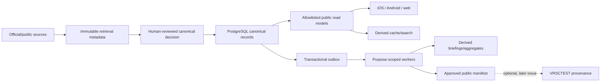

- Sources provide evidence; they do not directly mutate canonical public records.
- Reviewer/admin publication decisions are canonical application decisions.
- Object storage holds classified artifacts, never the only copy of a decision.
- Verus records are optional public commitments and never replace PostgreSQL.
- Precise location is intentionally absent from this storage diagram.

## 5. Current physical schema baseline

The logical model must evolve from the existing migrations without pretending planned
tables exist.

| Physical schema | Current status | Current responsibility |
| --- | --- | --- |
| `rmr_registry` | **Implemented** | Jurisdictions, districts, bodies, offices, people, terms, elections, candidacies, official identifiers, reviewed lifecycle history. |
| `rmr_source` | **Implemented** | Sources, connector versions, retrieval metadata, candidate/review history, reviewed records, coverage. |
| `rmr_public` | **Implemented** | Human-approved, source-backed read projections and timelines. |
| `rmr_account` | **Foundation only** | Saved broad country/province/state/territory preference and idempotency receipt; no account/authenticator persistence yet. |
| `rmr_location` | **Foundation only** | Reserved security domain; contains no location tables. Precise input must never be persisted. |
| `rmr_identity` | **Foundation only** | Reserved for future private identity/attestation records. |
| `rmr_participation` | **Foundation only** | Reserved for future private signals, ratings, subscriptions, and aggregates. |
| `rmr_moderation` | **Foundation only** | Reserved for future restricted evidence and due-process workflows. |
| `rmr_audit` | **Implemented** | Append-only privacy-minimized domain audit. |
| `rmr_outbox` | **Implemented** | Transactional events, leases, retry/dead-letter state, delivery receipts. |
| `rmr_security` | **Implemented** | Payload-free access-review decisions. |
| `rmr_provenance` | **Foundation only** | Reserved for later public manifests and anchor state. |
| `rmr_signer` | **Foundation only** | Reserved isolation boundary; must not contain private keys or expose RPC to application roles. |

Migrations `0001` through `0008` are the implemented physical baseline. Logical entities
marked **Planned** below require their own issue, migration, authorization, contracts,
tests, and release gate.

## 6. Civic registry ERD and entities

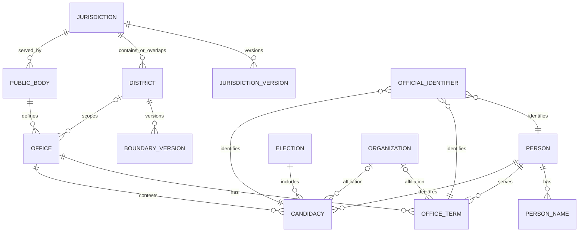

### 6.1 Registry entity catalog

| Entity / status | Stable ID and minimum fields | Cardinality and temporal rules | Owner, privacy, retention/correction |
| --- | --- | --- | --- |
| `jurisdiction` — **Implemented** | `jurisdiction_id`, `country_code`, `created_at` | One identity has many non-overlapping `jurisdiction_version` rows and graph edges. Multiple parents/overlaps are allowed; containment cycles and cross-country edges are rejected. | Civic registry; `PUB`; `H1`. Identity persists; corrected facts create versions/edges. |
| `jurisdiction_version` — **Implemented** | `version_id`, `jurisdiction_id`, name, slug, kind, status, `effective_from`, `effective_to`, assertion, `supersedes_version_id` | Many versions to one jurisdiction; no overlapping effective periods for the same jurisdiction. | Civic registry; `PUB`; `H1`; supersede, never rewrite published history. |
| `district` — **Implemented** | `district_id`, `country_code`, `created_at` | One identity has many effective-dated names, boundaries, jurisdiction relationships, and lineage links. | Civic registry; `PUB`; `H1`. |
| `boundary_version` — **Implemented** as `district_boundary_version` | `boundary_version_id`, `district_id`, geometry reference, SHA-256, licence/assertion reference, `effective_from`, `effective_to` | Many versions to one district; periods cannot overlap. Geometry bytes remain in an approved referenced store, not inline account/location data. | Civic registry/source; `PUB`; `H1`; a correction adds a new digest/version. |
| `public_body` — **Implemented** | `public_body_id`, `country_code`, effective-dated name/kind/status through `public_body_version` | One body defines many offices and may govern/serve/overlap multiple jurisdictions. | Civic registry; `PUB`; `H1`. |
| `office` — **Implemented** | `office_id`, `country_code`, effective-dated body, optional district, title, selection method, operational state | One office belongs to one public body version and has zero or many terms/candidacies over time. Office is structural and never identifies its holder. | Civic registry; `PUB`; `H1`. |
| `person` — **Implemented** | `person_id`, record state, `created_at`; names live in `person_name` | One person has many names, terms, candidacies, and official identifiers. Merge/split/distinct decisions require multi-source human review; names alone cannot resolve identity. | Civic registry; `PUB`; `H1`; resolution history is append-only. |
| `person_name` — **Implemented** | `person_name_id`, `person_id`, value, kind, language, `effective_from`, `effective_to`, assertion | Many names to one person; effective-dated; a primary-name uniqueness rule applies per period. | Civic registry; `PUB`; `H1`; supersede/correct through history. |
| `office_term` — **Implemented** | `office_term_id`, `person_id`, `office_id`, jurisdiction/body/district context, origin, selection method, capacity, planned period | Many terms to a person and office. A person cannot have overlapping terms for the same office. State is derived from append-only transitions. A winning candidacy never creates a term automatically. | Civic registry; `PUB`; `H1`. |
| `election` — **Implemented** | `election_id`, country, jurisdiction/body/office/district context, kind, date; versions carry name/state/effective period | One election has many candidacies and is separate from office terms. | Civic registry; `PUB`; `H1`. |
| `candidacy` — **Implemented** | `candidacy_id`, `person_id`, `election_id`, jurisdiction/district/office context, `created_at` | Unique per person/election/office. Lifecycle transitions are append-only. `won` is a candidacy outcome, not an office-term insert. | Civic registry; `PUB`; `H1`. |
| `organization` — **Planned** | `organization_id`, kind, public name, jurisdiction scope, `effective_from`, `effective_to`, source assertion | An organization can be related to many public-role records through effective-dated, source-backed affiliations. Citizen membership/association is outside this entity. | Civic registry; `PUB`; `H1`; corrections supersede affiliation versions. |
| `official_identifier` — **Implemented** across `external_identifier` and `public_role_official_identifier` | `official_identifier_id`, exactly one subject ID, issuer, identifier, effective period, assertion | Many identifiers to one entity; exactly one supported subject per row; issuer/value uniqueness is scoped by entity and period. | Civic registry; `PUB`; `H1`; an identifier does not grant authorization. |
| `external_identity_reference` — **Implemented inert reference** | `external_identity_reference_id`, `person_id`, kind, immutable reference, display snapshot, effective period, assertion | Many optional references to one person. `canonical_authority=false` and `grants_authorization=false` are enforced. | Civic registry; `PUB`; `H1`; a Verus reference remains optional and non-authoritative. |

### 6.2 Critical implemented registry constraints

- Effective periods for versions of one jurisdiction, district, boundary, body, or office
  cannot overlap.
- Cross-country structural edges are rejected.
- Effective-dated containment cycles are rejected.
- Person/office overlapping term periods are rejected.
- Candidacy context must match its election context.
- Office-term and candidacy transitions must be continuous and legal.
- Person resolution is append-only, human-reviewed, multi-source, and cannot use a name
  alone.
- Public views omit reviewer IDs, notes, and private resolution evidence.

## 7. Sources, claims, methodology, and public projections

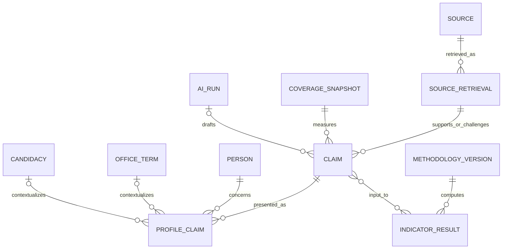

| Entity / status | Stable ID and minimum fields | Cardinality and temporal rules | Owner, privacy, retention/correction |
| --- | --- | --- | --- |
| `source` — **Implemented** | `source_id`, publisher, source type, canonical origin, licence/terms note, capability/status | One source has many retrievals and connector versions. It is evidence provenance, not a truth flag. | Source/coverage; `PUB`; `H1`. |
| `source_retrieval` — **Implemented** as `rmr_source.retrieval` | `retrieval_id`, `source_id`, requested/normalized/final URL metadata, retrieved time, outcome, HTTP metadata, content hash, immutable object reference | Many immutable attempts to one source. Conditional retries append attempts; raw bytes remain in classified object storage. | Source/coverage; public allowlist plus restricted operational detail; `H1`/`O1`. |
| `claim` — **Planned** | `claim_id`, subject kind/ID, claim type, normalized proposition, event/effective time, review state, `supersedes_claim_id` | A claim has one public-role subject and one or more supporting/challenging source retrievals. Versions/corrections append. | Evidence/public record; draft `MOD-R`, approved projection `PUB`; `M1`/`H1`. |
| `profile_claim` — **Planned** | `profile_claim_id`, `profile_id`, `claim_id`, display context/order, publication decision/version | Many claims may appear in one profile version; the same claim may support multiple approved views without duplication. | Public projection; `PUB`; `H1`; removed display is superseded, not silent factual deletion. |
| `coverage_snapshot` — **Implemented** in source domain; public report contract is synthetic | `coverage_snapshot_id`, scope, dimensions/denominators, method/policy version, generated/input-cutoff times, state | One snapshot has many coverage items. It is immutable and reproducible from canonical reviewed records. | Source/methodology; `PUB`; `H1`; corrections create a superseding snapshot. |
| `methodology_version` — **Planned** | `methodology_version_id`, method kind, semantic version, public specification digest/URL, approved state/time, supersedes | One immutable version produces many indicator/aggregate results. Draft and approved versions remain distinct. | Methodology; approved `PUB`; `H1`. |
| `indicator_result` — **Planned** | `indicator_result_id`, office-term/candidacy subject, method version, input cutoff/source set, value components, missing-data state, confidence, generated time, correction state | Many results over time for one public-role context. Missing data is explicit and never converted to a negative value. | Methodology/public record; `PUB`; `H1`; supersede on corrected inputs/method. |
| `ai_run` — **Planned** | `ai_run_id`, purpose, provider/model/process version, source IDs, redaction class, output reference, confidence, human reviewer/decision, created time | Zero or many purpose-limited runs may draft work; no run directly publishes or creates human intent. | Evidence/moderation; `MOD-R`; `M1`; public disclosure is a separate allowlisted field. |

Canonical public profile rows in `rmr_public` are **Implemented** derived projections.
They require a human publication decision and reviewed source links. They are rebuildable
and do not replace the registry, source retrieval, or future claim entities.

## 8. Accounts, identity, and authorization

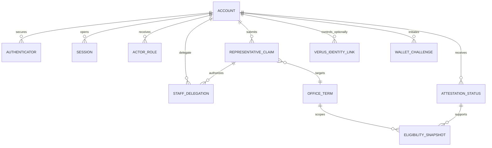

| Entity / status | Stable ID and minimum fields | Cardinality and temporal rules | Owner, privacy, retention/correction |
| --- | --- | --- | --- |
| `account` — **Foundation only** | `account_id`, lifecycle state, authentication tier, created/updated time | One account owns authenticators, sessions, private preferences, and role grants. It has no foreign key to `person`; representative authority uses a reviewed claim/delegation. | Account authentication; `ACCT`; `A1`. |
| `authenticator` — **Foundation only** | `authenticator_id`, `account_id`, method, public credential/verifier metadata, created/last-used/revoked times | Many authenticators to one account; secret verifiers are hashed/encrypted and never public. | Account authentication; `ACCT`; `A1`. |
| `session` — **Foundation only** | `session_id`, `account_id`, hashed refresh token, device class, assurance, issued/expiry/rotated/revoked times | Many revocable rotating sessions to one account; replay revokes the family. | Account authentication; `ACCT`; `A1`/bounded security retention. |
| `actor_role` — **Foundation only** | `role_grant_id`, `account_id` or service principal, role, scope kind/ID, effective period, grant/revoke audit refs | Many scoped, effective-dated grants per actor. Authentication tier is not encoded as role rank. | Account/authorization; `ACCT` or `SEC-R`; `A1`/`U1`. |
| `staff_delegation` — **Planned** | `staff_delegation_id`, representative authority/claim ID, staff account ID, office-term scope, permissions, effective period, state, review/audit refs | Many delegations per approved representative claim; expiry/revocation is independent of identity links. No transitive delegation. | Identity/authorization; `ID-P`; `I1`. |
| `representative_claim` — **Planned** | `representative_claim_id`, claimant account, target person and office term/candidacy, claimed capacity, evidence refs, state, submitted/reviewed/expiry times, decision/appeal refs | Many attempts may target one public role; at most one compatible active authority per approved scope under policy. | Identity/moderation; `ID-P` + `MOD-R`; `I1`/`M1`. |
| `verus_identity_link` — **Planned** | `verus_identity_link_id`, `account_id`, immutable i-address, network, proof purpose/version, verified/expiry/revoked times, current-state check | Many optional links per account subject to policy. It proves control only and cannot imply person, office, humanity, residence, eligibility, or truth. | Identity; `ID-P`; `I1`. |
| `wallet_challenge` — **Planned** | `wallet_challenge_id`, account/session binding, purpose, audience, network, nonce hash, issued/expiry/claimed times, response state | Many short-lived challenges per account; nonce is single-use and atomically claimed. Request/response payloads are not long-term sessions. | Identity; `ID-P`; short bounded `I1`. |
| `identity_update_request` — **Planned** | `identity_update_request_id`, approved authority, immutable payload digest/reference, network, purpose/schema, presented/expiry times, state, consent version | One request has zero or one accepted result. It is separate from login and optional for the profile. | Identity/Verus orchestration; `ID-P`, approved payload may become `PROV-PUB`; `I1`/`V1`. |
| `identity_update_result` — **Planned** | `identity_update_result_id`, request ID, operation/transaction reference, submitted/confirmed/readback times, exact readback digest, state/failure code, supersedes | At most one logical successful result per idempotent request; retries append attempts without duplicating the logical update. | Identity/Verus orchestration; public allowlist only after readback; `V1`. |
| `attestation_status` — **Planned** | `attestation_status_id`, `account_id`, provider/type, opaque non-enumerable reference, status, assurance, valid period, checked time | Many immutable provider snapshots per account. Minimum status only; no raw identity evidence. | Identity/attestation; `ID-P`; `I1`. |
| `eligibility_snapshot` — **Planned** | `eligibility_snapshot_id`, account, office term, rule/method version, attestation snapshot, broad jurisdiction evidence reference, outcome/reason class, evaluated/expiry times | One consequential command binds to one immutable snapshot. Eligibility is not inferred from a location lookup or Verus control. | Identity/participation; `ID-P`; `I1`. |
| `feature_flag` — **Foundation only** as typed configuration/audit policy | `feature_flag_id` or stable key, environment/cohort, value, policy version, changed time/actor/audit ref | Effective configuration is environment/cohort scoped and deny-by-default. A flag cannot bypass an invariant or release gate. | Security/operations; `SEC-R`; `U1`. |

### 8.1 Authorization separation

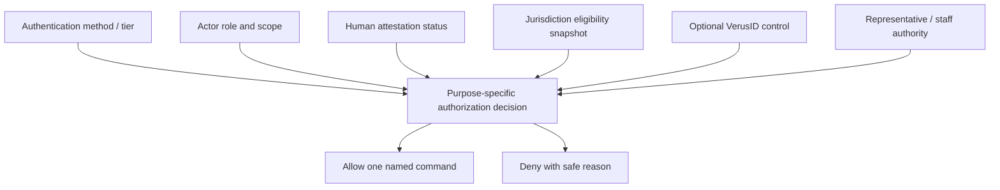

No arrow between these inputs means equivalence. For example, a moderator is not a
“more verified citizen,” and a VerusID link is not an eligibility snapshot.

## 9. Precise location and broad preferences

There is deliberately no `precise_location`, `address`, or `coordinate` entity. Precise
input is `LOC-T`/`T0`, exists only inside the issue #29 request scope, and is excluded
from PostgreSQL, object storage, cache, queues, outbox, audit, logs, traces, analytics,
crash reports, AI, and Verus.

`saved_broad_jurisdiction` is **Implemented** in `rmr_account` with:

- account-scoped composite identity;
- country plus optional province/state/territory only;
- no municipality, district, boundary, address, coordinate, or ambiguity token;
- row-level security;
- idempotent write receipts containing only hashes and safe metadata; and
- explicit update/delete commands.

It is `ACCT`/`A1`, not proof of residence, citizenship, voter registration, or
jurisdiction eligibility.

## 10. Human participation

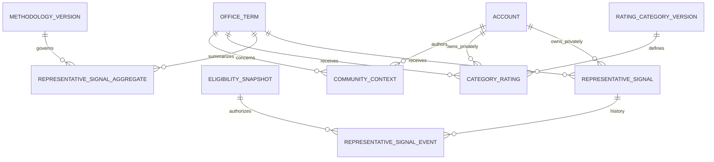

All entities in this section are **Planned**. `REPRESENTATIVE_SIGNALS_ENABLED`,
`CATEGORY_RATINGS_ENABLED`, and `COMMUNITY_CONTEXT_ENABLED` remain false.

| Entity | Stable ID and minimum fields | Cardinality and temporal rules | Owner, privacy, retention/correction |
| --- | --- | --- | --- |
| `representative_signal` | `representative_signal_id`, participant account, `office_term_id`, active value (`support` or `concern`), current event/version, created/updated time | At most one active row per eligible participant and office term, enforced by a unique constraint/partial index. No `skip`, neutral, absent, or inferred value is valid. | Human participation; `CIV-P`; `P1`; individual record is never public or representative-readable. |
| `representative_signal_event` | `signal_event_id`, signal/participant/term IDs, event kind (`confirmed_support`, `confirmed_concern`, `withdrawn`), eligibility/method/consent versions, prior event, idempotency/audit refs, occurred time | Append-only ordered history. Cancel, abandon, timeout, navigation, failed validation, and swipe-only interaction create no event. Withdrawal appends an event and removes the active projection. | Human participation; `CIV-P`; `P1`. |
| `representative_signal_aggregate` | `signal_aggregate_id`, office term, method version, eligibility/population/window rules, suppression state, interval/uncertainty, generated/input-cutoff times, correction/supersession | Many immutable aggregate versions per office term. Contains no participant IDs. Suppression and differencing rules govern publication. | Methodology/public aggregate; internal input `CIV-P`, approved output `PUB`; `H1`. |
| `rating_category_version` | `rating_category_version_id`, stable category key, scale/options, method/policy version, effective period, state | Many immutable versions per category. Scale changes require a new version. | Methodology; approved `PUB`; `H1`. |
| `category_rating` | `category_rating_id`, account, office term/candidacy, category version, value, participation label, confirmation, created/withdrawn time | Separate from representative signals and evidence. One-current-value rules are category/method scoped. | Human participation; `CIV-P`; `P1`; approved aggregate only. |
| `community_context` | `community_context_id`, author/account or approved public-submitter class, target, text reference, participation label, moderation state/version, submitted/withdrawn time | Enters moderation and never becomes a signal, rating, evidence fact, or official response. | Participation/moderation; `CIV-P` + `MOD-R`; `P1`/`M1`; public text is a separate approved projection. |

### 10.1 Representative-signal state machine

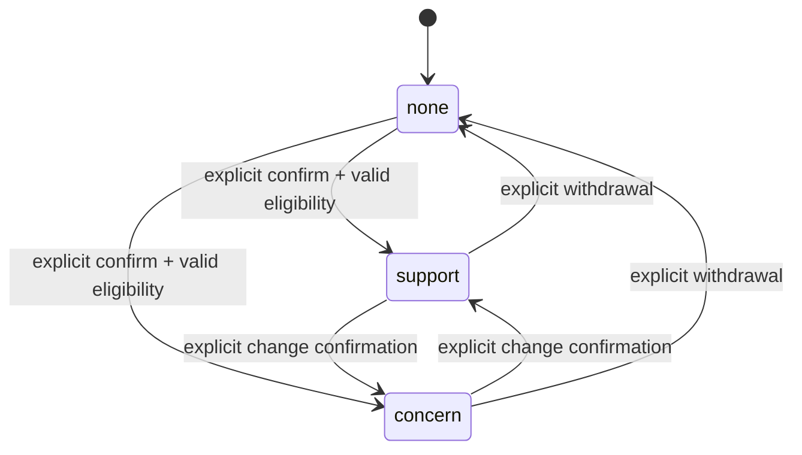

`skip` is not a state or transition. Cancellation, backgrounding, timeout, failed recent
presence, invalid attestation, and network failure all remain at the prior state and
write no signal event.

## 11. Civic Signal

All entities here are **Planned** and belong to monitoring/briefings, not participation
judgment.

| Entity | Stable ID and minimum fields | Cardinality and temporal rules | Owner, privacy, retention/correction |
| --- | --- | --- | --- |
| `civic_signal_subscription` | `subscription_id`, account, broad jurisdiction/person/office/issue/source/change filter, channel/frequency/quiet hours, state, created/paused/deleted time | Many purpose-limited subscriptions per account. It cannot call signal/rating commands. | Civic Signal; `CIV-P`; `A1`; user can pause, unsubscribe, and delete. |
| `civic_signal_briefing` | `briefing_id`, subscription/rule version, public source/record IDs, generated time, AI disclosure, correction/supersession, status | Many briefings per subscription; reproducible from identified public records. A corrected record creates a superseding briefing/update. | Civic Signal; private delivery `CIV-P`, source content `PUB`; `O1`/policy-bound user history. |
| `notification_delivery` | `delivery_id`, briefing, account/channel endpoint reference, attempt/status, queued/sent/failed time, provider-safe receipt | Many attempts per briefing/channel; endpoints are private and retained minimally. | Civic Signal/notifications; `ACCT`; `O1`/`A1`. |

## 12. Evidence, responses, corrections, and appeals

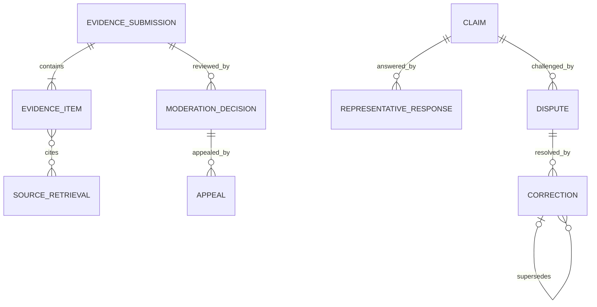

All entities here are **Planned**. Issue #55's source candidate review is an implemented
ingestion workflow, not the public evidence/due-process workflow below.

| Entity | Stable ID and minimum fields | Cardinality and temporal rules | Owner, privacy, retention/correction |
| --- | --- | --- | --- |
| `evidence_submission` | `evidence_submission_id`, submitter class/account when applicable, target, concise claim/challenge, declaration/conflict disclosure, state, policy version, submitted time | One submission has one or more structured items. Verified-human status is not universally required. No timer auto-publishes. | Evidence/moderation; `MOD-R`; `M1`; public outcome is separately projected. |
| `evidence_item` | `evidence_item_id`, submission, source URL/retrieval, publisher/date, excerpt/explanation reference, rights/classification, state | Many items to one submission; URL retrieval follows SSRF-safe source rules. Initial release has no arbitrary file upload. | Evidence/moderation; `MOD-R`; `M1`. |
| `representative_response` | `representative_response_id`, target claim/profile, approved representative authority, body reference, state, submitted/published/corrected times, optional public signature ref | Many versioned responses per target. Authority proves permission to respond, not truth. | Due process; draft `MOD-R`, approved `PUB`; `M1`/`H1`. |
| `dispute` | `dispute_id`, target record/version, requester class, reason/category, state, policy version, opened/resolved times | Many disputes may reference one public version; resolution never erases the original history. | Due process; restricted details `MOD-R`, approved status `PUB`; `M1`/`H1`. |
| `correction` | `correction_id`, target version, replacement/superseding version, reason, decision/policy refs, effective/published times | A correction points to exactly what it supersedes. Chains cannot self-reference or cycle. | Due process/public record; `PUB` outcome + `MOD-R` review; `H1`/`M1`. |
| `appeal` | `appeal_id`, appealed decision, appellant class/account, grounds, state, reviewer/conflict refs, filed/decided times | Many policy-permitted appeals per decision; decision history is append-only. | Due process; `MOD-R`, approved outcome may be `PUB`; `M1`. |
| `moderation_decision` | `moderation_decision_id`, target, reviewer role, assignment/conflict declarations, policy/method versions, outcome/reason, decided time, supersedes | Many immutable decisions over a target's history; reviewer identity/notes are excluded from public projection. | Moderation; `MOD-R`; `M1`; append/supersede. |

### 12.1 Evidence and moderation state machine

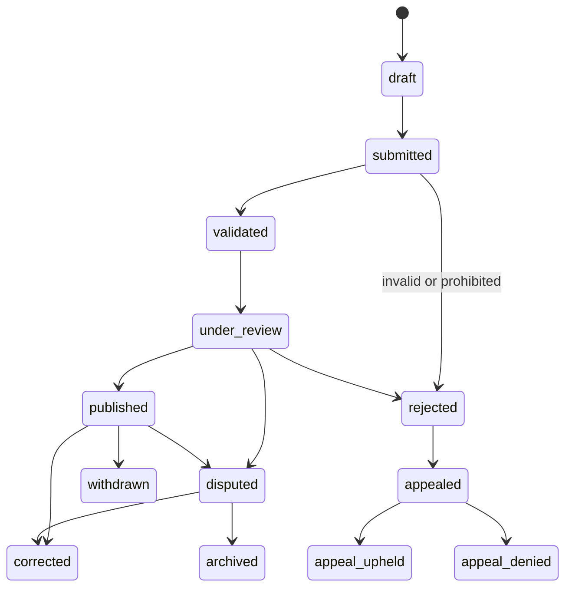

No automated publisher may bypass `under_review` and an accountable human decision.

### 12.2 Representative claim and staff delegation

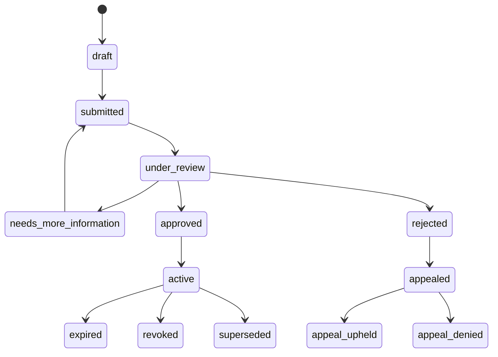

Staff delegation can become active only under an active approved authority. It expires
or revokes independently and cannot survive the authority or office-term scope.

### 12.3 Correction and supersession

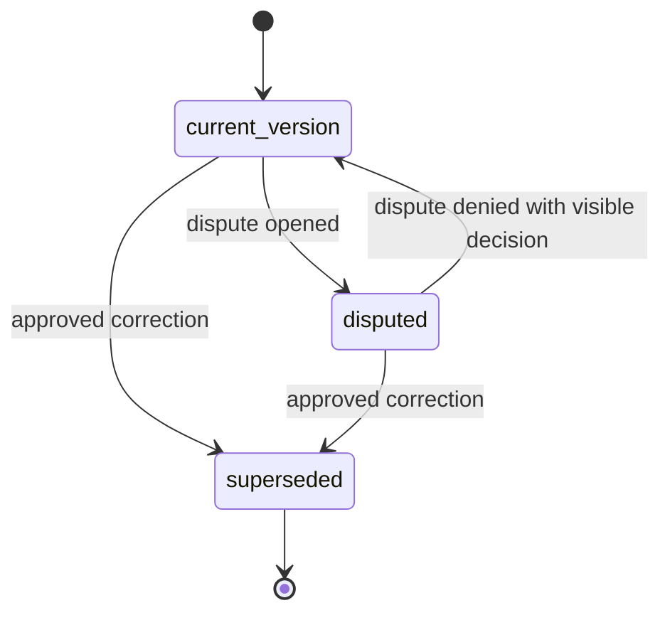

The superseded version remains addressable with its status and link to the replacement.

## 13. Audit, outbox, and optional provenance

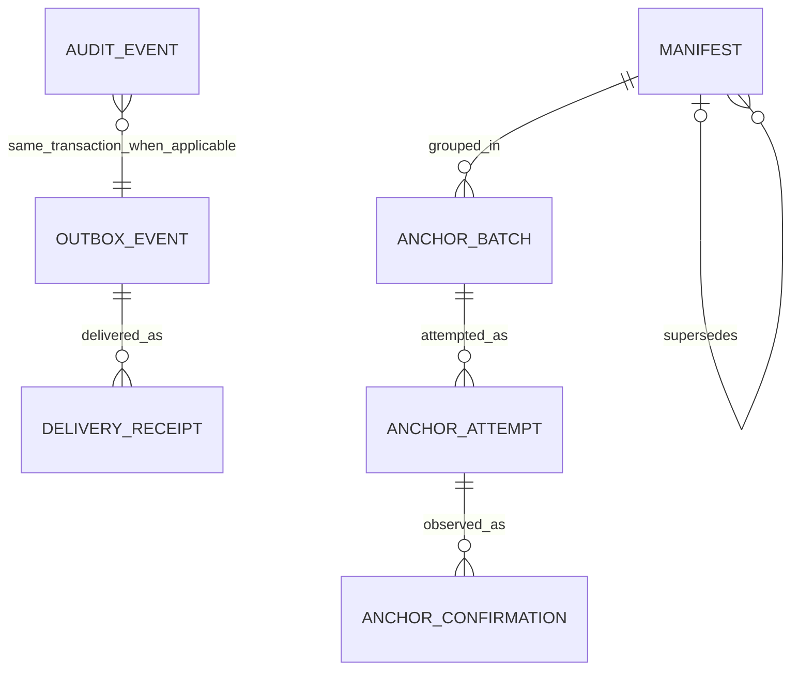

| Entity / status | Stable ID and minimum fields | Cardinality and temporal rules | Owner, privacy, retention/correction |
| --- | --- | --- | --- |
| `audit_event` — **Implemented** | `event_id`, event type/version, actor type/opaque ref, action, outcome, safe resource class/ref, occurred/recorded times, classification-safe metadata | Append-only. Sensitive request/response bodies and prohibited keys are structurally rejected. | Audit/security; `SEC-R`; `U1`. |
| `outbox_event` — **Implemented** | `event_id`, event type/version, aggregate ref/version, payload/classification, idempotency, created/available/lease/attempt/dead-letter times | Written in the same transaction as state/audit; claimed by allowlisted worker roles; duplicate delivery is expected and idempotent. | Outbox; classification follows payload; `U1`/`O1`. |
| `manifest` — **Planned** | `manifest_id`, schema/canonicalization version, public object refs, exact byte reference, SHA-256, generated/approved times, `supersedes_manifest_id`, privacy declaration | Immutable, deterministic public bytes. Contains allowlisted public data only. | Provenance; `PROV-PUB`; `V1`. |
| `anchor_batch` — **Planned** | `anchor_batch_id`, manifest set/digest, VDXF key/version, network, signer-purpose ref, state, queued time | One logical batch has many attempts but at most one logical verified anchor. | Provenance; `PROV-PUB` plus restricted operational refs; `V1`. |
| `anchor_attempt` — **Planned** | `anchor_attempt_id`, batch, idempotency key, submitted operation/tx reference, daemon/network policy version, attempt/state/failure, submitted time | Many attempts to one batch; lost acknowledgement is reconciled before resubmission. | Provenance; sanitized public status plus `SEC-R`; `V1`/`U1`. |
| `anchor_confirmation` — **Planned** | `anchor_confirmation_id`, attempt, block/tip reference, confirmation count/state, observed time, exact readback digest, verification state | Many observations to an attempt. `verified` requires confirmed exact readback; reorganization appends an orphaned observation and requeues. | Provenance; `PROV-PUB`; `V1`. |

### 13.1 Provenance state machine

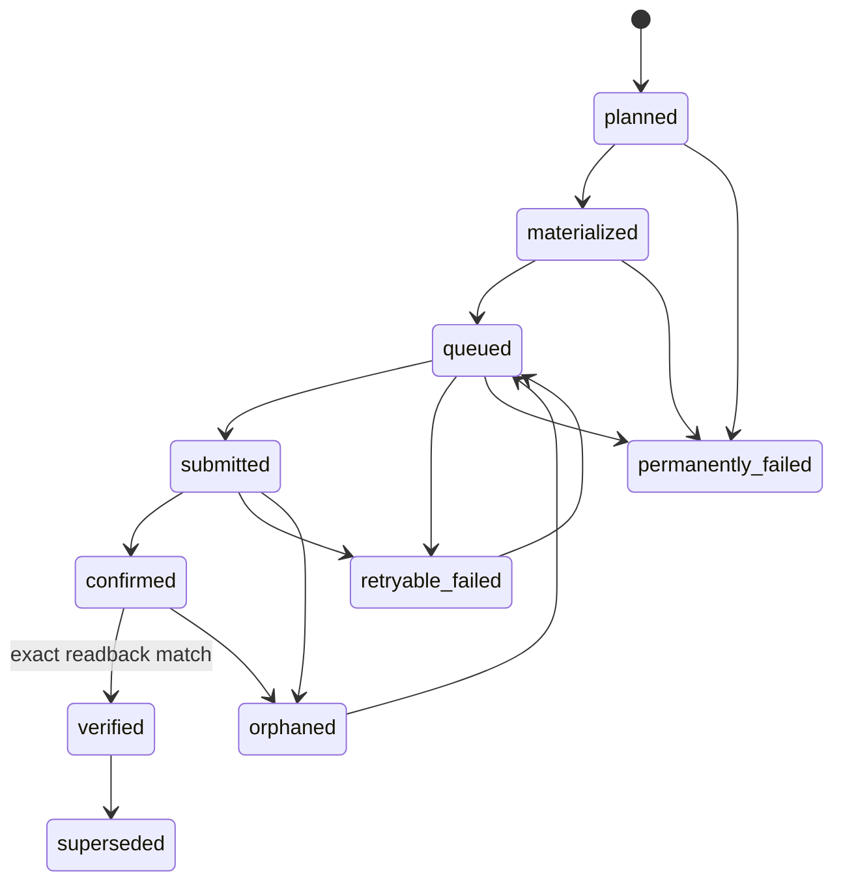

No unconfirmed or mismatched write is labeled verified. VRSCTEST precedes any mainnet
decision, and public reads remain independent of the provenance subsystem.

### 13.2 Wallet challenge and identity update state machines

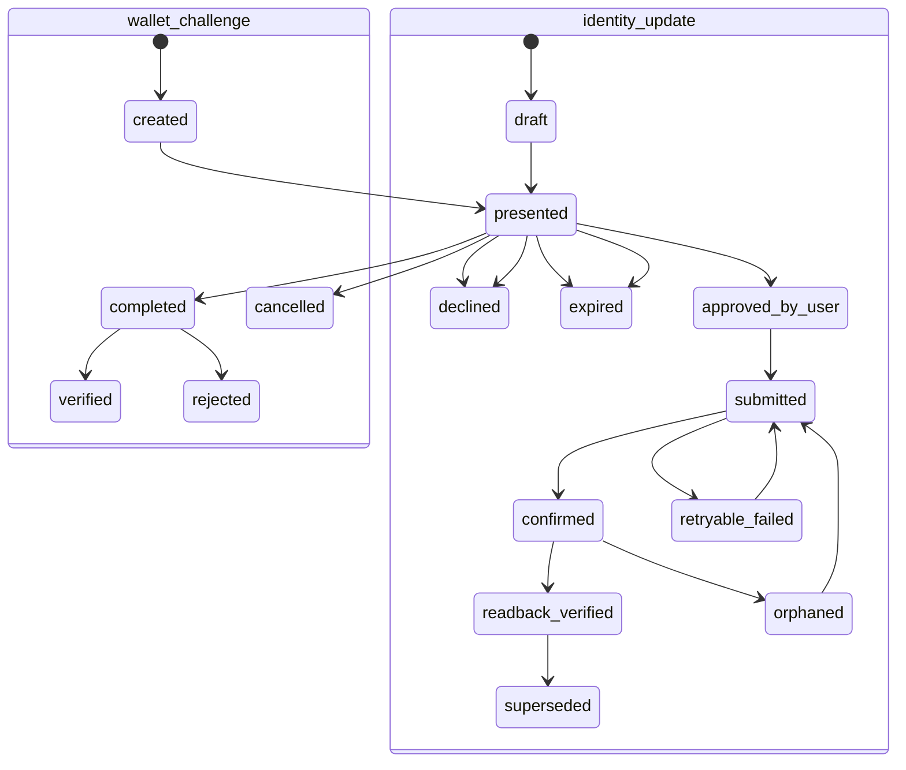

Identity update is not login. Decline, expiry, or failure cannot block or alter the
canonical application profile.

## 14. Database constraints required for future migrations

Later implementation issues must enforce these rules in both domain code and PostgreSQL:

| Invariant | Required database enforcement |
| --- | --- |
| Stable identities | Primary key per entity; external IDs held in scoped unique tables, never reused as RMR PKs. |
| Effective periods | `effective_to > effective_from`; exclusion/unique constraints prevent prohibited overlap. |
| One subject per polymorphic record | `num_nonnulls(...) = 1` or a typed association table, never an unchecked loose pair. |
| One active representative signal | Unique/partial unique constraint on participant + office term for active rows. |
| Active signal values | Check/enum limited to `support` and `concern`; there is no `skip` or `no_current_judgment`. |
| Append-only signal history | Reject update/delete/truncate on signal-event history; withdrawal is a new event. |
| Candidacy separation | Foreign keys to person, election, and office; no trigger that creates an office term from `won`. |
| Human-only civic intent | Actor-type and authorization evidence captured by the command transaction; service/agent principals cannot call the write function. |
| Private/public boundary | Public roles receive no grants on account, identity, participation-individual, or moderation schemas; public views are explicit allowlists. |
| Attestation/eligibility independence | Separate foreign keys/snapshots; neither value is derived from a VerusID link or saved broad jurisdiction alone. |
| Correctable history | Immutable versions plus non-self-referencing `supersedes` foreign keys; cycle prevention where chains are traversed. |
| Transactional effects | State change, redacted audit, and outbox insert commit atomically; idempotency receipt prevents duplicate logical commands. |
| Aggregate privacy | Aggregate rows contain no account/signal-event IDs; publication state requires the approved suppression/differencing method. |
| No Social Credit | No public view/function may join account identity to individual civic activity; no generalized citizen-score entity or cross-context reputation column. |
| Optional Verus | No registry/profile foreign key may require a Verus identity, update, anchor, or chain state. |

## 15. No Social Credit enforcement model

The model prohibits a generalized citizen score by construction:

- public-role accountability is keyed to a public office term/candidacy, never a citizen
  account profile;
- account authentication, human attestation, eligibility, representative authority, and
  Verus control remain separate contexts rather than levels on one reputation ladder;
- individual signals, ratings, subscriptions, and moderation history are private-domain
  records without a public join path;
- public aggregates omit participant identifiers and are suppression-policy controlled;
- abuse/rate-limit records are purpose-limited, time-bounded security controls and cannot
  become portable reputation values;
- AI runs cannot infer or publish citizen ideology, loyalty, or trustworthiness; and
- no `citizen_score`, `social_credit`, `political_profile`, generalized `trust_score`, or
  cross-context eligibility entity is permitted.

Any future migration, query, export, analytics event, AI input, or manifest that weakens
these rules requires rejection, not merely a feature flag.

## 16. Deletion, correction, and account closure

- Public civic facts use correction/supersession. A lawful removal uses a visible safe
  tombstone when policy permits, while restricted source material may be removed from
  serving/storage independently.
- Account/authenticator/session records follow approved access, correction, export,
  revocation, and deletion policy. Public civic records are not owned by an account and
  are not erased merely because a claimant account closes.
- Individual participation supports explicit withdrawal. Account deletion behavior for
  private history must be fixed by privacy/retention policy before issue #37; published
  historical aggregates are never silently recomputed under a new rule.
- Attestations and eligibility expire/revoke without rewriting the fact that a past
  command used a then-current snapshot.
- Moderation records preserve decision and appeal history subject to lawful deletion,
  privilege, safety, and legal-hold policy.
- Audit/outbox records remain data-minimized and policy-bounded; they never retain raw
  sensitive payloads as a shortcut.
- On-chain/public manifest material may be durable. Corrections therefore publish an
  explicit superseding reference rather than promising erasure RMR cannot perform.

## 17. Migration and compatibility strategy

Issue #2 is documentation-only and requires no migration or rollback. Future physical
implementation follows these rules:

1. Add one forward migration per issue; never edit an applied migration.
2. Use expand/migrate/contract for breaking schema changes. Deploy additive nullable or
   defaulted fields first, backfill with deterministic audited jobs, switch readers, then
   remove old fields only after the compatibility window and recovery evidence.
3. Preserve stable RMR IDs and public URLs across table splits, merges, or projection
   rebuilds. Mapping tables must be explicit and reversible during migration.
4. Test every migration from an empty database and the latest prior schema. Verify
   checksums and idempotent startup behavior.
5. Backfills operate by bounded primary-key ranges, are restartable/idempotent, record
   safe progress, and never fabricate source/review decisions.
6. Security-domain grants, row-level security, public-view allowlists, backup
   classification, audit redaction, and outbox worker scopes ship in the same migration
   as sensitive tables.
7. Rollback means disabling new writes/readers and restoring a verified pre-migration
   backup or forward-fixing append-only history; destructive down migrations are not
   assumed safe.
8. API/JSON Schema changes remain additive or receive an explicit version bump and
   generated-client compatibility plan.

## 18. Issue boundaries and non-goals

This baseline does not implement:

- production accounts, authenticators, or authorization routes;
- representative claims or staff delegation;
- Civic Signal subscriptions or notifications;
- human attestations or jurisdiction eligibility;
- representative-signal, rating, context, evidence, moderation, response, correction,
  appeal, AI, methodology-execution, or aggregate writes;
- VerusID proof, identity creation/update, RPC, VDXF keys, manifests, provenance writes,
  testnet transactions, or mainnet work;
- production source providers or automatic publication; or
- a Representative Accountability Score or any citizen score.

Each planned entity becomes operational only through its owning issue and release gates.
