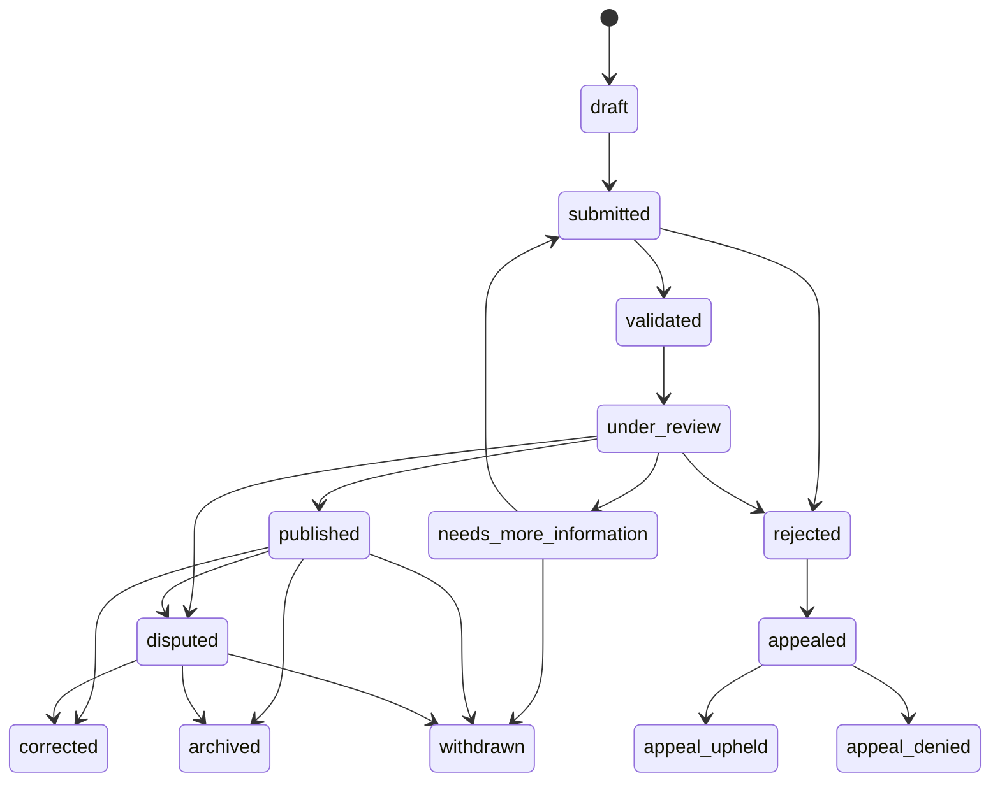

# Moderation and Due-Process Policy

**Status:** Accepted policy baseline; workflows are not implemented

**Version:** `moderation-due-process-policy.v1`

**Issue:** [#5](https://github.com/constitutionalmoney/rate-my-representatives-app/issues/5)

**Runtime gates:** `PRIVILEGED_ACCESS_ENABLED=false`,
`EVIDENCE_SUBMISSION_ENABLED=false`, and `COMMUNITY_CONTEXT_ENABLED=false`

**Automatic publication:** Prohibited

**Verus dependency:** None

## 1. Purpose and authority

This policy governs how Rate My Representatives may receive, review, publish, dispute,
correct, withdraw, archive, and appeal public-record material. It covers evidence
submissions, claims, official responses, correction requests, disputes, community
context, and source retraction or loss.

The policy creates no operational intake or publication capability. Future issues must
separately implement authorization, storage, retrieval, queues, public projections,
notifications, and release evidence. Until those issues are approved, every submission
and moderation route remains unavailable.

The canonical application decision remains in PostgreSQL. A source, identity,
attestation, signature, AI output, provenance digest, or blockchain confirmation can
support attribution or auditability; none proves that a claim is true.

## 2. Non-goals and hard boundaries

- A representative signal or category rating is human participation, not evidence.
- Community context is moderated public expression, not a verified fact, official
  response, representative signal, or rating.
- Civic Signal discovers and summarizes approved records; it does not adjudicate them.
- Verified-human status is not a universal evidence-submission requirement.
- Authentication, VerusID control, attestation, role, authority to speak for an office,
  and truth are independent facts.
- AI may find candidate sources, extract text, classify a queue, detect duplicates, or
  draft a summary. It cannot publish an allegation, resolve a dispute, decide an appeal,
  or impersonate a human participant.
- No elapsed time, queue age, missed response target, source popularity, identity tier,
  payment, or blockchain state can cause publication.
- Issue #5 performs no source retrieval, file upload, moderation action, public write,
  notification, Verus RPC, provenance write, or mainnet operation.

## 3. Record classes and public meaning

| Record | Meaning | Never means |
| --- | --- | --- |
| Evidence submission | A request that identified material be reviewed | The material is true or publishable |
| Evidence item | A structured source reference and submitter explanation | An approved public claim |
| Claim/public record | A version approved for an allowlisted public projection | Infallible or endorsed by RMR |
| Representative response | A versioned statement from approved representative authority | Proof that the underlying claim is true or false |
| Dispute | A reasoned challenge to a specific record version or decision | Automatic retraction or vindication |
| Correction | A new public version that identifies and supersedes an earlier version | Silent replacement or deletion |
| Withdrawal | The originator no longer advances its own submission or response | A finding about accuracy |
| Archive | Material is retained as history but is no longer current or ordinarily displayed | Erasure or a correction |
| Community context | Separately labeled moderated public commentary | Evidence, a rating, or representative speech |
| Appeal | Independent review of an identified decision under this policy | A fresh popularity vote on the subject |

Restricted submissions, review notes, assignments, abuse indicators, contact details,
and legal communications are `MOD-R` or `SEC-R`. Public outcomes are separate `PUB`
allowlisted projections. A public record must never expose the restricted review object.

## 4. Eligibility, attribution, and labels

Evidence eligibility is evaluated independently from representative-signal and
category-rating eligibility. Future intake may accept the following submitter classes,
subject to jurisdiction, abuse, rate-limit, and legal controls:

| Submitter class | Required public label | Attribution and review treatment |
| --- | --- | --- |
| Representative or candidate | `representative` or `candidate` | Authority scope and office/candidacy context shown; authority does not confer accuracy |
| Authorized staff | `authorized_staff` | Active application-local delegation required and scope shown |
| Journalist | `journalist` | Organization or self-description may be shown only when verified for attribution |
| Researcher | `researcher` | Affiliation and method declaration required when claimed publicly |
| Basic account | `account_holder` | Account status supports rate limiting and contact, not truth |
| Verified participant | `verified_participant` | Attestation status may affect abuse controls and priority, not factual weight |
| Organization | `organization` | Named accountable contact and authority to submit required; organization status is not endorsement |
| Public contributor without an account | `public_contributor_unverified` | Distinct label, stricter rate limits, safe reply channel, and no verified-human implication |

Pseudonymous or anonymous public evidence may be accepted only when a later approved
intake policy can establish a safe contact, abuse, and legal process. Public anonymity
must not hide the submitter class from authorized reviewers. Identity evidence remains
private and cannot be used as a reputation score.

Representatives, candidates, and authorized staff have routes to submit responses,
correction requests, disputes, and appeals. Their statements receive an authority label
but pass the same source, rights, safety, conflict, and reasoned-decision controls.

## 5. Evidence state machine

The state history is append-only. The current projection may change only through one of
the transitions below. There are no implicit, scheduled, or wildcard transitions.



| From | To | Required decision or event |
| --- | --- | --- |
| `draft` | `submitted` | Submitter confirms the target, declaration, sources, and requested review |
| `submitted` | `validated` | Mechanical eligibility, required-field, safety, and duplicate checks pass; this is not factual approval |
| `submitted` | `rejected` | Accountable human rejects an ineligible or prohibited submission from safe metadata and records appeal eligibility; validation never auto-rejects |
| `validated` | `under_review` | Accountable reviewer accepts an assignment after conflict screening |
| `under_review` | `published` | Human reviewer approves an allowlisted version with a reasoned decision |
| `under_review` | `disputed` | A material unresolved challenge must be visible with any safe public projection |
| `under_review` | `rejected` | Human reviewer records a policy reason and appeal eligibility |
| `under_review` | `needs_more_information` | Reviewer identifies the missing, safe-to-request information |
| `needs_more_information` | `submitted` | Submitter provides a new immutable version addressing the request |
| `needs_more_information` | `withdrawn` | Submitter stops advancing the submission; review history remains |
| `published` | `disputed` | A validated material challenge is opened against that exact version |
| `published` | `corrected` | A new approved public version supersedes the identified version |
| `published` | `withdrawn` | The originator withdraws where policy permits; public historical status remains |
| `published` | `archived` | A reasoned currency, relevance, retention, or lawful-display decision is recorded |
| `disputed` | `corrected` | Review approves a superseding public version |
| `disputed` | `withdrawn` | The originator withdraws and the historical dispute status remains inspectable |
| `disputed` | `archived` | Review closes ordinary display while preserving the version and dispute outcome |
| `rejected` | `appealed` | Eligible appellant files timely grounds against the identified decision |
| `appealed` | `appeal_upheld` | Independent reviewer sets aside the decision and records the remedy or remand |
| `appealed` | `appeal_denied` | Independent reviewer affirms the decision with a reason |

`appeal_upheld` and `appeal_denied` are immutable appeal outcomes. When an appeal is
upheld, any remand creates a linked new review version rather than rewriting the old
decision. `corrected`, `withdrawn`, and `archived` likewise preserve the prior version.

## 6. Connected workflow contracts

Each workflow uses immutable events, target/version references, policy version, actor
class, time, and a reason. Cross-workflow links do not merge their meanings.

### 6.1 Evidence submission

```text
draft -> submitted -> validated -> under_review
submitted -> rejected
under_review -> published | disputed | rejected | needs_more_information
needs_more_information -> submitted | withdrawn
published -> disputed | corrected | withdrawn | archived
disputed -> corrected | withdrawn | archived
rejected -> appealed -> appeal_upheld | appeal_denied
```

Validation checks eligibility and safety only. Publication always requires a human
decision after review. Similar or duplicate submissions may be linked or closed with a
reason; popularity never increases factual weight.

### 6.2 Representative response

```text
draft -> submitted -> authority_validated -> under_review
under_review -> published | rejected | needs_more_information
needs_more_information -> submitted | withdrawn
published -> corrected | withdrawn | archived
rejected -> appealed -> appeal_upheld | appeal_denied
```

Authority validation proves permission to speak for the stated scope. Responses remain
separate from RMR findings and may link to the exact claim, dispute, or correction they
address. Authorized staff can use the same route within an active delegation.

### 6.3 Correction request

```text
draft -> submitted -> validated -> under_review
under_review -> approved | rejected | needs_more_information
needs_more_information -> submitted | withdrawn
approved -> corrected
rejected -> appealed -> appeal_upheld | appeal_denied
```

Approval creates a new version with `supersedes` and public reason links. It does not
mutate the old version. Factual, attribution, context, and presentation corrections must
be distinguished; a presentation-only change cannot conceal a material change.

### 6.4 Dispute

```text
draft -> submitted -> validated -> under_review
under_review -> dispute_upheld | dispute_denied | needs_more_information
needs_more_information -> submitted | withdrawn
dispute_upheld -> corrected | withdrawn | archived
dispute_denied -> archived
```

Opening a validated material dispute changes the affected public version to `disputed`
when safe to display. The decision identifies the challenged proposition and version.
A denial does not erase the challenge or prevent a policy-permitted appeal of the
underlying moderation decision.

### 6.5 Appeal

```text
draft -> submitted -> validated -> under_review
under_review -> appeal_upheld | appeal_denied | needs_more_information
needs_more_information -> submitted | withdrawn
```

An appeal reviewer must be independent of the original decision and its supervisory
chain where practicable. The reviewer sees the complete permissible record, the original
reason, disclosed conflicts, and the appellant's grounds. The outcome and remedy append
to, never replace, the original decision.

### 6.6 Community-context moderation

```text
draft -> submitted -> validated -> under_review
under_review -> published | rejected | needs_more_information
needs_more_information -> submitted | withdrawn
published -> corrected | withdrawn | archived
rejected -> appealed -> appeal_upheld | appeal_denied
```

Context must be labeled by participation class and moderation state. It cannot be
converted into evidence, a rating, a representative signal, or an official response.
Moderation considers relevance, safety, privacy, harassment, manipulation, and source
claims without treating agreement with RMR or a representative as a criterion.

### 6.7 Source retraction or loss

```text
available -> stale | missing | unavailable | retracted
stale -> available | missing | unavailable | retracted
missing -> available | unavailable | retracted
unavailable -> available | missing | retracted
retracted -> superseded
```

`stale` means the expected refresh window was missed. `missing` means an expected record
was not supplied. `unavailable` means retrieval or access was lost. `retracted` means the
publisher withdrew or materially repudiated the source. `superseded` requires an
identified replacement. Any non-available state quarantines new use and triggers impact
review for dependent public versions. Missing or lost material is a coverage condition,
never misconduct by the subject.

## 7. Source quality, rights, retrieval, and quarantine

Reviewers must record source identity, publisher, original/copy status, relevant date,
jurisdiction, claim fit, retrieval version, content hash, corroboration, conflicts,
availability, and known corrections. Authority and proximity are assessed for the
specific proposition; no publisher receives universal truth status.

Licence, terms, attribution, retention, quotation, redistribution, privacy, and
copyright status must be reviewed before storage or publication. A public URL is not
automatic permission to copy or republish its contents.

Future retrieval must use the approved SSRF-safe connector boundary: allowlisted HTTPS
origins, DNS and redirect revalidation, private/link-local/metadata address rejection,
content-type and size limits, bounded decompression, timeouts, and malware handling.
Unapproved, malformed, dangerous, encrypted, rights-unclear, or conflicting material is
quarantined and cannot reach a public projection.

Arbitrary file uploads remain disabled until issue #39 or a successor supplies approved
malware scanning, isolation, rights declarations, retention/destruction rules, safe
preview, access logging, incident response, and staffed moderation. Reviewers must not
download evidence to unmanaged personal devices.

## 8. Assignment, conflicts, and reasoned decisions

Before viewing restricted merits, each reviewer records an assignment and declares:

- personal, family, employment, financial, campaign, donor, party, advocacy, litigation,
  or public-position conflicts;
- prior involvement in the submission, source, subject, disputed decision, or appeal;
- whether recusal, reassignment, secondary review, or documented no-conflict applies.

A conflicted reviewer cannot decide the matter. Urgent safety restriction may be applied
by an authorized on-call reviewer, but a non-conflicted reviewer must promptly confirm,
modify, or lift it. Appeal reviewers cannot be the original decider.

Every material decision requires the generated `moderation-decision.v1` shape and:

- decision, target, workflow, and prior-state identifiers;
- reviewer role, assignment, conflict outcome, and independence where applicable;
- source-record versions and rights-review result;
- this policy version and any applicable methodology version;
- stable reason code, plain-language public reason, and decision time;
- disclosed AI assistance and an accountable human decider;
- superseded or appealed decision links;
- public-projection state and explicit provenance eligibility.

Restricted notes are referenced from the classified system; they are never copied into
the public decision object, audit payload, outbox payload, log, client, or provenance
manifest.

## 9. Notice and opportunity to respond

When publication could materially harm a person or organization, the reviewer normally
provides the identified subject or authorized representative:

1. the specific proposed public proposition and material source references;
2. a safe explanation of the process and response/correction routes;
3. a target response date based on urgency and complexity; and
4. notice of the publication decision and appeal route where policy permits.

Notice may be delayed or narrowed when it would create a credible safety risk, prejudice
a lawful investigation, expose protected submitter information, violate a legal order,
or be impossible after documented reasonable attempts. The exception and approval must
be recorded. Failure to respond by a target date never causes automatic publication and
is not evidence that the proposition is true.

## 10. Decisions, correction, withdrawal, archival, and restriction

- **Correction** replaces a materially wrong or incomplete public version with an
  identified superseding version. The original, public reason, time, and link remain.
- **Withdrawal** records that the originator no longer advances its submission or
  response. It makes no independent truth finding.
- **Archival** removes a non-current version from ordinary display while keeping a safe,
  addressable historical status and reason.
- **Source retraction** records a publisher action and triggers impact review; it does
  not automatically determine every dependent claim.
- **Emergency restriction** temporarily limits display or access for credible doxxing,
  threat, privacy, malware, court-order, or serious safety risk. It requires an audit
  event, scoped reason, approver, review deadline, and later confirm/modify/lift decision.

Silent permanent erasure is prohibited. Where law requires removal, the public surface
uses the safest lawful notice or tombstone and retains restricted decision history only
to the extent law and the approved retention schedule permit. Legal hold does not make
restricted material public.

## 11. Appeals

The decision notice must state who may appeal, permitted grounds, how to file, and the
target filing window. Good-cause late filing, accessibility accommodation, and inability
to obtain the decision must be considered. A deadline never auto-decides the merits.

Appeals ordinarily address material factual error, wrong policy or method version,
procedural unfairness, undisclosed conflict, new material evidence unavailable despite
diligence, disproportionate restriction, or an unlawful decision. The appeal reviewer
records independence, reviews both favorable and unfavorable material, and issues a
reasoned outcome and remedy. An upheld appeal may remand, correct, lift a restriction,
or require a new independent review. Original decisions and appeal history remain
inspectable at their appropriate access level.

## 12. Abuse, safety, coordinated manipulation, and legal requests

- Doxxing, credible threats, targeted harassment, sexual exploitation material,
  malware, impersonation, fabricated sources, and attempts to expose private keys or
  credentials are quarantined and escalated immediately.
- Duplicate floods, brigading, sockpuppets, coordinated submissions, and adversarial
  source laundering may affect rate limits and queue handling, never factual truth.
- Political viewpoint, criticism of RMR, criticism of a representative, and lawful
  disagreement are not abuse categories.
- Reporter and subject privacy are purpose-limited; the public receives only the minimum
  safe attribution label.
- Law-enforcement, court, copyright, privacy, preservation, and takedown requests use a
  documented legal-review route with authority, scope, jurisdiction, time, disclosure,
  preservation, challenge, and audit decisions. Staff do not improvise responses.
- Imminent safety matters use the incident process and emergency restriction rule; they
  do not bypass later independent review.

## 13. AI assistance

Any AI-assisted discovery, extraction, translation, clustering, drafting, or safety
classification records its purpose, provider/model or process version, source inputs,
redaction class, limitations, confidence where meaningful, and human reviewer. Public
text materially drafted or translated by AI receives an appropriate disclosure.

AI output stays a candidate. Reviewers must inspect the cited source and make their own
decision. AI cannot infer private traits, create synthetic public participation, rank a
person's civic worth, settle contested facts, or publish. A model failure must degrade
to a human queue or unavailable state, not an automatic adverse outcome.

## 14. Queues, staffing, escalation, and service targets

Operational launch requires named accountable owners and staffed queues for intake,
source safety, ordinary review, representative responses, corrections, disputes,
appeals, legal/privacy, and urgent safety. Coverage must include handoff, leave,
conflict-reassignment, incident escalation, and backlog recovery.

The following are initial service **targets**, not automatic state transitions:

| Queue | Acknowledge target | Initial action target | Escalation |
| --- | --- | --- | --- |
| Credible threat, doxxing, malware, or key exposure | 1 hour while pilot is staffed | Restrict/quarantine and page on-call promptly | Safety/security and legal as applicable |
| Published-record material correction | 1 business day | Triage within 3 business days | Data steward and moderation lead |
| Representative response or dispute | 2 business days | Assign within 5 business days | Moderation lead; conflict reassignment |
| Ordinary evidence/community context | 3 business days | Assign or request information within 10 business days | Queue owner at target breach |
| Appeal | 3 business days | Independent assignment within 7 business days | Governance/legal for independence failure |

Complexity, language access, safety, new evidence, legal process, or fairness may require
more time. The requester receives a status update without a merits inference. Queue age
never publishes, rejects, archives, or upholds a record.

A pilot is blocked until staffing capacity, training, access controls, conflict coverage,
language/accessibility support, service-target measurement, escalation ownership, and
incident exercises are evidenced and approved. Software readiness alone is insufficient.

## 15. Public history and provenance

Public displays must identify current, disputed, corrected, withdrawn, archived, and
superseded status; link the original and replacement versions; show public reasons and
decision times; and distinguish a representative response from an RMR decision. Search,
cache, briefing, and notification projections must consume correction events and avoid
presenting a superseded version as current.

Only an approved, allowlisted public projection may enter a future provenance manifest.
Raw submissions, private identity evidence, reviewer identity, assignments, conflicts,
review notes, abuse indicators, contact details, private response material, legal
communications, and quarantine contents are excluded from Verus anchors.

A correction produces a new manifest that identifies the prior public manifest through
`supersedes`; it never rewrites durable history. A hash, signature, timestamp, VDXF key,
contentmultimap entry, or blockchain confirmation proves a commitment to particular
bytes. It does not prove truth, completeness, fairness, reviewer independence, or legal
compliance. Provenance remains optional and no chain write is part of this policy issue.

## 16. Audit, privacy, retention, and access

State changes, assignments, conflict outcomes, access decisions, emergency restrictions,
publication decisions, corrections, appeals, legal actions, and provenance approvals
append privacy-minimized audit records. Domain state, audit, and outbox intent must be
transactional when later implemented. Raw evidence and notes never enter audit/outbox
payloads.

Least privilege separates intake, reviewer, appeal reviewer, administrator, legal,
security, public reader, worker, provenance, and signer access. Staff access is
phishing-resistant, time-bound where elevated, logged, reviewed, and revoked on role
change. Retention follows `M1`, `H1`, `SEC-R`, legal-hold, and approved destruction rules;
the system stores no material merely because storage is available.

## 17. Implementation and release gates

Issue #5 accepts the policy, ADR, transition contract, decision schema, and synthetic
tests only. Follow-on issues #39, #16, #17, and #58 must not become operational until
they add their own threat analysis, authorization, persistence, privacy, abuse,
accessibility, observability, backup/restore, and staffed-operations evidence.

Before any evidence or community-context pilot, all of the following must be approved:

- legally reviewed evidence, community, privacy, copyright, retention, and request rules;
- production source rights and safe retrieval controls;
- upload malware/isolation controls if uploads are proposed;
- representative notice, response, correction, dispute, and independent appeal exercises;
- staffed queues, service metrics, conflict reassignment, and safety/legal escalation;
- restricted/public projection tests and deletion/correction/hold procedures;
- the accepted [`THREAT_MODEL.md`](./THREAT_MODEL.md) baseline, independent security
  review, backup/restore, and incident exercises; and
- explicit enablement of only the required false-by-default feature gates.

Automatic publication is not a gate that can be enabled; it is prohibited by policy.

## 18. Change control

Material changes to eligibility, state transitions, reviewer independence, notice,
public history, safety restrictions, service targets, AI authority, or provenance fields
require a new policy version, public change note, contract/test updates, governance
review, and migration plan for in-flight cases. Existing decisions retain the policy and
method versions used when they were made.

| Version | Date | Status | Change |
| --- | --- | --- | --- |
| `moderation-due-process-policy.v1` | 2026-08-10 | Accepted policy baseline; execution disabled | Defined eligibility, seven connected workflows, reviewer conflicts, notice, visible correction/history, independent appeals, safety/legal handling, staffing gates, AI limits, and public-only provenance |
