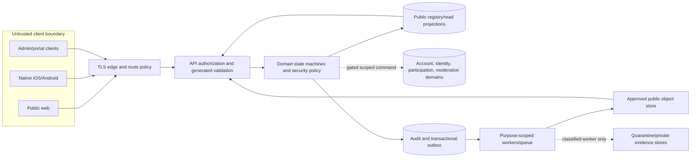

# Application, Mobile, AI, and Verus Threat Model

**Status:** Accepted security-design baseline; independent review and production exercises are pending

**Version:** `application-threat-model.v1`

**Issue:** [#6](https://github.com/constitutionalmoney/rate-my-representatives-app/issues/6)

**Data mode:** Synthetic foundation evidence only

**Runtime effect:** None; every high-risk feature remains disabled by default

## 1. Purpose, method, and assurance language

This document identifies assets, actors, trust boundaries, threats, privacy harms,
controls, test evidence, residual risk, safe degradation, and incident ownership for
Rate My Representatives (RMR). It covers implemented foundations and planned paths across
native iOS/Android, web, API, workers, source ingestion, moderation, AI, Verus Mobile,
RMR-managed representative VerusIDs, and public provenance.

The model uses qualitative severity because a numeric score would imply precision that
the current pre-release evidence cannot support. A threat can remain a pilot blocker even
when a foundation control exists. This model distinguishes four control states:

| Code | Meaning |
| --- | --- |
| `I` implemented foundation | Code and automated synthetic tests exist on `main`; this is not production assurance |
| `P` accepted policy | A normative control exists in an approved document but its runtime path is not implemented |
| `F` future required | The owning implementation/release issue must build and evidence the control |
| `U` unresolved | Governance, legal, protocol, provider, or operational decisions are still open |

Test evidence is separately labeled `implemented`, `planned`, `manual_required`, or
`independent_review_required`. A build, schema, unit test, local daemon read, installed
wallet, or VRSCTEST experiment proves only the exact property tested. It is not a
penetration test, DPIA, production incident exercise, signer audit, wallet compatibility
certification, or mainnet authorization.

## 2. Scope, system status, and non-goals

| Capability | Current status in this model |
| --- | --- |
| Anonymous source-backed profile reads | Implemented synthetic foundation; public allowlisted projections only |
| Accounts, passkeys, recovery, privileged sessions | Contract/test foundation; production providers and persistence disabled |
| Location resolution | Privacy-minimized synthetic foundation; precise input is transient and gated |
| Native iOS/Android shell | Implemented foundation with safe links, secure-storage ports, push policy, and disabled wallet harness |
| Official-source ingestion | Synthetic candidate-only foundation; production sources and evidence intake disabled |
| Moderation and due process | Accepted policy/contract; no operational intake, queue, or publication command |
| AI research | Policy only; no runtime AI provider or autonomous publication |
| Optional VerusID account linking | Planned and disabled; no cryptographic end-to-end claim is made |
| Representative-controlled identity update | Superseded/not authorized for the initial RMR-managed directory model; retained as a distinct future threat class |
| RMR-managed representative VerusIDs/activity | Planned under issues #80-#83; no provisioning or activity write is enabled |
| Public provenance | Planned and disabled; PostgreSQL and exact public bytes remain canonical |
| Mainnet | Out of scope and prohibited by this issue |

This model does not enable a feature, approve a provider, assign a named incident
commander, establish production retention periods, certify a third party, or authorize
testing against systems RMR does not control. It does not require Mirror-State treasury,
reserve, currency, token, DEX, PBaaS, or citizen-identity architecture.

Registry capture and public-memory manipulation are in scope because attackers may try
to distort the public civic record or its durable history. Treasury/reserve compromise
is outside the core RMR boundary and cannot become an application dependency.

## 3. Security and privacy invariants

1. PostgreSQL application records are canonical. Verus is optional identity/provenance
   infrastructure and cannot become the only copy of a public record or correction.
2. Anonymous safe public reads do not require an account, AI provider, wallet, Verus
   daemon, signer, attestation provider, notification provider, or source connector.
3. High-risk feature flags are false when absent. A flag is necessary but never
   sufficient for release.
4. No public/native/web/general-worker process receives a private key, WIF, seed, wallet
   file, signer credential, unrestricted RPC credential, or private object-store key.
5. Precise location, account/session material, identity evidence, individual civic
   activity, moderation material, private evidence, and signer/RPC data never enter a
   public serializer, general log, analytics event, crash report, audit payload, public
   manifest, or chain write.
6. Authentication, role, VerusID control, attestation, eligibility, representative
   authority, factual truth, moderation approval, and provenance verification remain
   independent facts.
7. A representative signal, rating, comment, official response, moderation decision,
   wallet approval, identity update, or release decision requires accountable human
   authority. AI and service agents cannot exercise human intent.
8. Missing data, source loss, service outage, identity revocation, or wallet decline
   cannot become adverse evidence about a citizen or representative.
9. No authorized query, feature, model, export, analytic, or integration may create a
   generalized citizen reputation, ideology, loyalty, conformity, civic-worth, trust,
   eligibility, or risk profile. A feature flag cannot waive this invariant.
10. Automatic publication of allegations is prohibited. Corrections and appeals append
    visible history; they do not silently overwrite an earlier public version.
11. A hash, signature, VDXF key, contentmultimap entry, timestamp, or chain confirmation
    proves a commitment or signer action under stated conditions, never truth,
    completeness, fairness, office, unique humanity, or endorsement.
12. Core builds/tests need no Verus software, node, wallet, identity, key, fund, network
    call, or production civic data. Mainnet writes are impossible in CI.

## 4. Assets and required security properties

| Asset class | Examples | Classification/source of truth | Required properties |
| --- | --- | --- | --- |
| Public civic registry | people, jurisdictions, offices, terms, candidacies | `P0`; PostgreSQL canonical | integrity, effective dates, source links, correction history, availability |
| Source records | connector declarations, retrieval metadata, reviewed versions, coverage | `P0/P1`; PostgreSQL plus approved object references | origin/rights integrity, freshness, quarantine, reproducibility |
| Accounts and sessions | emails, passkeys, recovery, session families, role grants | `P2`; account domain when implemented | confidentiality, enumeration resistance, revocation, least privilege |
| Location resolution | submitted address/coordinate and returned district IDs | precise input `P2/T0`; public IDs canonical | transient processing, non-retention, output minimization |
| Identity and attestation | VerusID links, provider status, eligibility snapshots | `P2`; application-local observations | purpose binding, expiry/revocation, minimum disclosure, non-reputation |
| Private civic activity | signals, ratings, preferences, subscriptions | `P2`; participation domain | confidentiality, withdrawal, aggregate privacy, no representative access |
| Representative authority | profile claims, staff delegation, scope/expiry/appeal | `P2/P0 projection`; application-local | anti-impersonation, conflict review, expiry/revocation, least privilege |
| Evidence and moderation | submissions, quarantine, notes, assignments, decisions | `P1/P2`; moderation domain | safe handling, conflict recusal, due process, public/private separation |
| Methods and aggregates | methodology versions, coverage, confidence, approved aggregates | `P0` after review | reproducibility, missing-data safety, anti-manipulation, correction |
| AI inputs and jobs | source-linked drafts, redacted prompts, model/process versions | `P1/P2` by input; never canonical truth | minimization, tool isolation, disclosure, human review, deletion |
| Native apps and delivery | builds, signing, app links, wallet links, push credentials | build/release systems; scoped secrets | provenance, environment isolation, safe links, secure storage, update safety |
| Verus requests/identities | nonces, signed requests/responses, public i-address inventory | app challenge state plus chain observation | replay resistance, exact audience/network/purpose, current-state validation |
| Public manifests/anchors | canonical bytes, digest, VDXF key, confirmation/readback | exact bytes/PostgreSQL canonical; chain derived | deterministic bytes, allowlist, idempotency, supersession, honest status |
| Signer and RPC | request/provenance/provisioning authorities, credentials, node access | `P2/SIGN`; external isolated operations | separation of duties, network restriction, rotation, compromise response |
| Backups, analytics, support | snapshots, crash reports, telemetry, support exports | classification preserved end to end | minimization, encryption, restore isolation, export allowlists, retention |

## 5. Threat actors

| Actor code | Actor | Capability and motivation considered |
| --- | --- | --- |
| `external_attacker` | Unauthenticated or remote attacker | credential theft, injection, denial, data theft, link/callback forgery |
| `compromised_user` | Account or device controlled by an attacker | valid-session abuse, civic-data access, malicious submissions |
| `representative_or_staff` | Current/former/false representative or delegate | profile takeover, overbroad authority, suppression, unauthorized response |
| `coordinated_group` | Organized political or influence group | brigading, source laundering, capture, differencing, public-memory manipulation |
| `malicious_submitter` | Evidence/context contributor | doxxing, malware, fabricated material, internal-network retrieval |
| `colluding_moderators` | Reviewers acting together or under pressure | conflict concealment, false publication, selective correction or appeal |
| `insider` | Staff, contractor, operator, or administrator | unauthorized joins/exports, secret access, audit evasion, destructive change |
| `data_broker` | Commercial data collector | identity/civic linkage, inferred political profiles, resale |
| `scraper` | Automated public reader | enumeration, longitudinal profiling, availability pressure |
| `source_publisher` | Legitimate or impersonated publisher | poisoned/changed/retracted material, ambiguous authority, licence restriction |
| `compromised_dependency` | Package, build action, SDK, app-store, or CI dependency | code execution, artifact replacement, credential theft |
| `ai_provider` | Model/provider or compromised AI boundary | retention, prompt leakage, fabrication, tool manipulation, silent model change |
| `wallet_link_attacker` | Malicious app/site/QR/deep-link/callback actor | substitution, scheme confusion, replay, wrong audience/network |
| `compromised_signer_or_node` | Compromised Verus authority, RPC, or stale/malicious node | forged request/write, censorship, reorg, false readback, mainnet confusion |
| `operator_error` | Accidental misconfiguration or unsafe manual action | wrong environment, broad grant, lost acknowledgement, destructive retry |

Threats include actor collaboration. Identity tier, public office, employment, or a valid
signature never removes an actor from review.

## 6. Data flow and trust boundaries

### 6.1 Core reads, accounts, participation, and review

The edge cannot confer authority. Every state-changing route must repeat authorization at
the domain boundary. Public reads use allowlisted projections and cannot join private
domains. Domain state, privacy-minimized audit, and outbox intent are one transaction
when later workflows are implemented.

### 6.2 Sources, AI, moderation, and public memory

```mermaid
flowchart LR
  Internet["Untrusted source internet"]
  Fetcher["Isolated SSRF-safe fetcher"]
  Quarantine["Quarantine and restricted parsing"]
  AI["Optional purpose-limited AI draft"]
  Review["Assigned human review and due process"]
  Canonical[("Canonical reviewed PostgreSQL version")]
  Projection["Allowlisted public projection"]
  Public["Web/native public read"]

  Internet --> Fetcher
  Fetcher --> Quarantine
  Quarantine -. "redacted source-linked candidate" .-> AI
  Quarantine --> Review
  AI --> Review
  Review --> Canonical
  Canonical --> Projection
  Projection --> Public
```

Retrieval, parsing, AI output, elapsed time, submitter status, and source signatures
cannot publish. Dangerous content stays quarantined. A reviewer conflict causes recusal
or reassignment, and public history retains disputes, corrections, and appeals.

### 6.3 Wallet, RMR-managed identities, and provenance

```mermaid
flowchart LR
  Client["RMR client"]
  API["RMR API/challenge state"]
  RequestSigner["Isolated request-signing service"]
  Wallet["Verus Mobile"]
  Callback["Public callback plus polling recovery"]
  Outbox["Approved public-write outbox"]
  Manifest["Exact allowlisted public manifest bytes"]
  ProvenanceSigner["Isolated provisioning/provenance signer"]
  Node["Explicit VRSCTEST node"]
  Chain["Verus chain observation"]
  PG[("Canonical PostgreSQL record and verification state")]

  Client -. "explicit gesture; disabled" .-> Wallet
  API -. "purpose-bound signed request" .-> RequestSigner
  RequestSigner -.-> Wallet
  Wallet -. "signed response" .-> Callback
  Callback -. "verify request, response, identity state" .-> PG
  PG -. "approved public event only" .-> Outbox
  Outbox -.-> Manifest
  Manifest -.-> ProvenanceSigner
  ProvenanceSigner -. "private RPC network" .-> Node
  Node -.-> Chain
  Chain -. "confirmation plus exact readback" .-> PG
```

All dotted flows are disabled/planned. Request signing, account linking, representative
identity provisioning, and activity provenance use separate purposes and authorities.
The client never decides success. PostgreSQL remains readable and correctable when every
dotted dependency is unavailable.

## 7. Trust-boundary register

| Boundary | Crossing | Principal controls | Failure rule |
| --- | --- | --- | --- |
| `B01` client to edge | Untrusted web/native/admin input | TLS, exact hosts, size limits, CSP/platform policy, no client authority | Reject malformed/mismatched input without echoing secrets |
| `B02` edge/API to domain | Parsed request to authorization/state machine | generated schema, actor/scope/gate checks, idempotency, domain re-authorization | Deny by default; no partial state |
| `B03` service to PostgreSQL domains | Public and classified records | separate roles/schemas, RLS/security barriers, least privilege, audited cross-domain access | Public service cannot query private domains |
| `B04` domain to queue/workers | Async intent and delivery | transactional outbox, allowlisted event families, payload minimization, idempotency | Duplicate safe; restricted bodies prohibited |
| `B05` worker to object storage | Public/quarantine/private/manifests | separate buckets/principals, classification-preserving backup, no general-worker key | Wrong bucket/principal denied and audited |
| `B06` source internet to fetch/parse | Untrusted URLs and bytes | HTTPS allowlist, DNS/redirect revalidation, internal-address denial, limits, isolation | Quarantine or unavailable; never publish |
| `B07` privileged human to admin/portal | Moderation/authority decisions | phishing-resistant short session, assignment, scope, conflict/recusal, reasoned audit | Expiry/conflict denies or reassigns |
| `B08` RMR to external providers | email, passkey, attestation, AI, push | minimum contract, purpose/consent, no raw evidence, provider isolation, outage fallback | Dependent action unavailable; public reads remain |
| `B09` RMR to wallet/callback | signed request/response and deep link/QR | explicit gesture, pinned schema, nonce/expiry/audience/network/session/current identity | No link/update on any mismatch or lost return |
| `B10` app to signer/RPC/node | request/provisioning/provenance operation | separate identity/purpose/network, private RPC, explicit VRSCTEST, sync/readiness, exact readback | No client/general-worker access; no inferred success |
| `B11` CI/build to released app | source, dependencies, signing, artifacts | pinned toolchain/lockfile, SBOM, scoped signing, reproducible evidence, store review | Unsigned dev build is not release evidence |
| `B12` canonical data to analytics/support/backup | derived operational copies | positive allowlists, redaction, no political profiling, encryption, restore isolation | Classification never decreases in transit/copy |

## 8. Threat and privacy-harm catalog

The table records the controlling response, not a claim that every control is deployed.
Owner names/contact rotations must be assigned before a pilot; the roles below establish
responsibility only.

| ID | Scenario and actors | Controls and evidence | Residual risk / safe degradation | Incident owner |
| --- | --- | --- | --- | --- |
| `AUTH-01` | Account takeover, credential stuffing, session replay, recovery abuse (`external_attacker`, `compromised_user`) | `I` generic auth/recovery, one-time challenges, rotation/replay tests; `F` production WebAuthn/email adapters, risk monitoring, recovery exercise | **High, pilot blocker:** providers/persistence unapproved. Revoke session family; anonymous reads remain | Security lead |
| `AUTH-02` | Role escalation or route-only authorization bypass (`compromised_user`, `insider`) | `I` scoped grants, privileged-session rule, route plus domain denial, security-domain audit; `F` production access review | **High:** a new grant bug can cross domains. Disable privileged commands; retain public reads | Security lead |
| `AUTH-03` | Representative profile takeover, false/former staff delegation, self-approval (`representative_or_staff`, `colluding_moderators`) | `P` application-local authority, scope/expiry/recusal/appeal; `F` #62 implementation and impersonation tests | **Critical, pilot blocker:** authority workflow absent. Keep claims/responses disabled | Identity/authority owner |
| `PRIV-01` | Precise-location leakage into persistence, logs, queues, AI, crash reports, backups (`external_attacker`, `insider`, `data_broker`) | `I` transient resolver, table-free schema, redaction/forbidden-field tests; `F` provider and production telemetry review | **High:** provider/host behavior untested. Disable resolver and offer broad manual selection | Privacy lead |
| `PRIV-02` | Disclosure of individual signals, ratings, subscriptions, evidence, identity status (`insider`, `representative_or_staff`, `scraper`) | `I` domain separation/public serializers; `P` data model and access rights; `F` participation/moderation persistence tests | **Critical:** future private stores absent. Disable affected writes/exports; public records stay available | Privacy lead |
| `PRIV-03` | Aggregate re-identification, differencing, small-cell or longitudinal attacks (`data_broker`, `scraper`, `coordinated_group`) | `P` separate participation labels and no individual access; `F` threshold/noise/differencing method and adversarial tests | **High, pilot blocker:** no approved aggregate privacy method. Publish no aggregate | Privacy/methodology owners |
| `NSC-01` | Hidden citizen score, ideology inference, portable abuse/reputation profile, unrelated eligibility (`insider`, `data_broker`, `ai_provider`) | `I` forbidden schema/export terms and domain tests; `P` immutable Covenant; `F` #57 repository/analytics/AI enforcement and independent review | **Critical, pilot blocker:** future integrations can reintroduce linkage. Reject release/export; preserve narrow states only | Privacy and governance leads |
| `SRC-01` | Poisoned, impersonated, stale, changed, contradictory, or retracted official source (`source_publisher`, `coordinated_group`) | `I` versioned connector declarations, identifier-plus-context matching, quarantine, freshness/coverage; `P` correction policy | **High:** production publishers unapproved. Mark unavailable/stale and retain last reviewed version with status | Data stewardship lead |
| `SRC-02` | Copyright/database/API misuse or over-retention (`source_publisher`, `operator_error`) | `I` rights declaration/metadata; `P` link/minimum excerpt rule; `F` production legal/licence review and deletion exercise | **High, pilot blocker:** rights vary by source. Quarantine or metadata-only; do not republish bytes | Data stewardship/legal |
| `SRC-03` | SSRF, DNS rebinding, redirects, metadata/internal RPC access, decompression/size abuse (`malicious_submitter`, `external_attacker`) | `I` isolated injected resolver/transport, origin/DNS/redirect/address/content limits and tests; `F` production egress sandbox | **High:** deployment network controls untested. Disable retrieval; accept no automatic candidate | Platform security |
| `SRC-04` | Malicious document, parser compromise, archive bomb, exploit persistence (`malicious_submitter`, `compromised_dependency`) | `P` uploads disabled and quarantine; `F` isolated conversion/scanning, patching, safe preview, destruction and incident drills | **Critical, pilot blocker:** arbitrary upload stack absent. Reject uploads and unsupported content | Platform security |
| `AI-01` | Hallucinated person/source/quote, biased conclusion, silent model drift (`ai_provider`, `coordinated_group`) | `P` source-linked draft only, disclosure, human review, no score/publication; `F` versioned eval/red-team suite | **High, pilot blocker:** no approved provider/evals. Use manual research or unavailable state | AI governance owner |
| `AI-02` | Prompt injection, tool-scope escape, source-page instructions, automated civic intent (`malicious_submitter`, `source_publisher`, `ai_provider`) | `I` service actors rejected from human-intent commands; `P` no direct publication; `F` isolated tools/allowlists/adversarial tests | **Critical:** future tools could cross authority. Disable tool/AI path; human performs scoped action | AI governance/security |
| `AI-03` | Private-data exfiltration, provider retention/training, cross-user leakage (`ai_provider`, `insider`) | `I` data classification forbids sensitive AI input; `F` provider contract, redaction gateway, deletion/egress tests | **Critical, pilot blocker:** no approved processing agreement. Send no private data; disable AI | Privacy/AI owners |
| `MOD-01` | Moderation capture, collusion, concealed conflict, false publication/correction/appeal (`colluding_moderators`, `coordinated_group`, `insider`) | `P` explicit states, assignment, conflict/recusal, independent appeal, immutable history, no timer; `F` console separation and audit review | **Critical, pilot blocker:** no staffed independent queue. Close intake/publication | Moderation lead |
| `MOD-02` | Doxxing, threats, harassment, protected-source exposure (`malicious_submitter`, `representative_or_staff`, `coordinated_group`) | `P` quarantine, emergency restriction, minimum public attribution, legal/safety escalation; `F` staffing/training/exercise | **Critical:** responder coverage absent. Restrict material, disable intake, use private incident path | Safety/moderation lead |
| `MOD-03` | Brigading, duplicate floods, sockpuppets, source laundering (`coordinated_group`, `compromised_user`) | `P` rate limits/duplicate linkage separated from truth; `F` abuse controls, queue fairness and appeal tests | **High:** controls may suppress legitimate participation. Slow/close intake, never infer truth | Moderation/security |
| `MOB-01` | Compromised dependency/build/action, artifact replacement, signing-key theft, malicious update (`compromised_dependency`, `insider`) | `I` pinned Node/pnpm, lockfile, CI builds, SBOM, unsigned dev artifacts; `F` release signing, provenance, store tracks, rollback/recovery drill | **Critical, pilot blocker:** no production signing/release evidence. Do not ship a release | Mobile release/security |
| `MOB-02` | Malicious Universal/App Link, custom-scheme confusion, QR substitution, open redirect (`wallet_link_attacker`, `external_attacker`) | `I` exact hosts/schemes/routes, no query/fragment/userinfo, stable IDs, explicit wallet gesture, VRSCTEST check; `F` associated-domain/device matrix | **High:** OS/wallet variations unverified. Reject link and allow safe in-app navigation/restart | Mobile/identity owners |
| `MOB-03` | Clipboard leakage, screenshots/previews, insecure local storage, incomplete sign-out cleanup (`compromised_user`, `external_attacker`) | `I` Keychain/Keystore adapter contract and clear-all behavior; `P` no sensitive wallet envelope copy; `F` device backup/screenshot/clipboard tests | **High:** platform adapter and lifecycle evidence incomplete. Clear state and require re-authentication | Mobile security |
| `MOB-04` | Push-token theft, political content in previews, environment mix-up, notification inference (`external_attacker`, `data_broker`, `operator_error`) | `I` consent, environment-bound opaque payload, allowlisted route, quiet hours, unregister/rotation; `F` provider credentials and device tests | **Medium/high:** provider metadata remains external. Disable push; app/public reads continue | Mobile/privacy owners |
| `VRLOGIN-01` | Replayed/forged response, wrong account/session/audience/purpose/network, revoked/recovered identity, unsupported schema (`wallet_link_attacker`, `compromised_signer_or_node`) | `P` random single-use bound challenge and current identity checks; `I` disabled native launch/return/polling harness; `F` #31 cryptographic E2E | **Critical, pilot blocker:** harness is not signature validation. Create no link; account/public reads remain | Identity/wallet owner |
| `VRUPDATE-01` | Unsafe or hidden `IdentityUpdateRequest`, bundled consent, wrong payload/chain/fee/identity (`wallet_link_attacker`, `representative_or_staff`, `operator_error`) | `P` separate ceremony/full public payload/readback constraints; current path superseded and unauthorized; `F` new governance issue if revived | **Critical:** no current business need. Keep feature absent; local profile/corrections remain | Governance/identity owner |
| `VRMANAGED-01` | Wrong representative/parent, name collision, compromised custody, duplicate identity creation (`compromised_signer_or_node`, `insider`, `operator_error`) | `P` #80-#82 deterministic naming, reviewed batch, separate custody, idempotency/reconciliation/readback, VRSCTEST-only | **Critical, pilot blocker:** hierarchy/custody/runbooks unapproved. Provision nothing | Verus operations/governance |
| `PROV-01` | RPC exposure, signer compromise, wrong authority/network, accidental mainnet write (`compromised_signer_or_node`, `operator_error`, `insider`) | `I` isolated empty signer domain and false gates; `P` separate request/provenance/provisioning authority; `F` private adapter, allowlists, rotation/recovery | **Critical, pilot blocker:** signer topology unapproved. No write; public records unaffected | Verus operations/security |
| `PROV-02` | Stale/unsynced/malicious node, lost acknowledgement, duplicate write, reorg/orphan, false verification (`compromised_signer_or_node`, `operator_error`) | `P` outbox/idempotency, explicit sync/readiness, confirmation, historical/current readback, recoverable states; `F` VRSCTEST fault tests | **High:** protocol behavior not evidenced for RMR payloads. Mark pending/unverified and retry only after reconciliation | Provenance owner |
| `PROV-03` | Content overwrite, wrong VDXF key, non-array contentmultimap, oversized payload, unrelated-content loss (`operator_error`, `compromised_dependency`) | `P` deterministic exact bytes, versioned keys, preflight, array read-merge-write, single writer, supersession; `F` #32-#35/#83 tests | **High, pilot blocker:** namespace/size/concurrency unresolved. Do not submit; retain exact public manifest locally | Provenance owner |
| `PROV-04` | Signature/anchor presented as factual truth or current authority (`scraper`, `source_publisher`, `coordinated_group`) | `I` `provesTruth=false`; `P` public verifier language and correction links; `F` UI/usability/adversarial review | **High democratic harm:** users can over-trust durable records. Show source/method/review/status and never “truth verified” | Product/data stewardship |
| `OPS-01` | Broad grant, wrong environment, secret in config/log/chat, destructive retry, emergency override (`operator_error`, `insider`) | `I` deny-by-default roles, secret scan/redaction, VRSCTEST config, outbox; `F` secret manager, two-person changes, incident/runbook exercises | **Critical, pilot blocker:** production operations unassigned. Disable affected writes, rotate/revoke, preserve audit | Platform/security |
| `OPS-02` | Backup, analytics, crash, support, or export reconstructs political profile (`insider`, `data_broker`, `compromised_dependency`) | `I` classification/allowlist/redaction and synthetic backup manifest; `F` production restore/export/telemetry inspection and retention approval | **Critical:** external tools can copy sensitive data. Stop export/telemetry, revoke access, assess notification | Privacy/platform |
| `REG-01` | Scraping, enumeration, defacement, source capture, or coordinated public-memory distortion (`scraper`, `coordinated_group`, `source_publisher`) | `I` source-backed immutable versions and public serializer; `P` coverage/dispute/correction/provenance-not-truth; `F` availability/rate/accessibility and editorial monitoring | **High democratic/availability risk:** public facts are inherently enumerable. Preserve access, throttle abuse proportionately, publish corrections/gaps | Data stewardship/platform |

## 9. Domain-specific attack requirements

### 9.1 Authentication, authority, and recovery

Production authentication must use reviewed passkey/email providers, opaque account IDs,
generic start/completion/recovery responses, short one-time challenges, hashed/rotated
sessions, replay-family revocation, and phishing-resistant privileged sessions. Recovery
cannot restore an expired/revoked role, representative authority, attestation,
eligibility, or VerusID-control observation. A representative/staff claim binds the exact
person, office term/candidacy, permissions, effective dates, reviewer, and appeal.

### 9.2 Privacy and No Social Credit

Individual civic activity is political-opinion data even when a user calls it harmless.
Public-role data and citizen data are different populations. Aggregate release requires
an approved method for minimum population, suppression, differencing, repeated queries,
time windows, participation labels, correction, and adversarial testing. Until then,
publication is blocked.

A suspected No Social Credit path is a security/privacy incident, not merely a product
disagreement. Stop the query/export/model/integration, preserve minimized evidence,
notify privacy/governance owners, assess affected people and downstream recipients,
delete or correct unauthorized derivatives where lawful, and require independent review
before restoration.

### 9.3 Sources, evidence, and documents

The submitted URL and every redirect remain untrusted. Resolution occurs immediately
before each connection through an isolated egress boundary. Parsing receives no internal
network or signer credential. Initial contributor evidence permits structured URLs only;
arbitrary files remain rejected until malware scanning, archive/converter isolation,
rights/retention, safe preview, destruction, responder training, and incident exercises
are approved.

### 9.4 AI

AI input follows the most restrictive source classification. Retrieved source text is
data, never instruction. Tools use positive allowlists, least-privilege credentials,
bounded output, no state-changing/human-intent authority, and no access to private civic,
signer, or unrestricted moderation stores. Publicly material AI assistance records
purpose, model/process version, inputs, redaction, limitations, and human reviewer.
Provider outage or policy mismatch returns to a manual queue or unavailable state.

### 9.5 Moderation and safety

Review staff cannot approve their own submission/authority, conceal a conflict, or turn
queue age into publication. Emergency restriction is narrow, audited, time-bound, and
independently reviewed; it does not silently erase history. Threats, doxxing, sexual
exploitation material, malware, key exposure, and legal requests use restricted incident
routes. Political viewpoint and criticism are not abuse categories.

### 9.6 Native apps and links

Native builds minimize permissions and telemetry. Sensitive sessions use OS-protected
storage and clear on sign-out, revocation, compromise, deletion, or environment switch.
App/Universal Links accept exact HTTPS hosts and allowlisted routes. Wallet launch
requires a displayed relying-party origin, explicit user gesture, short expiry,
VRSCTEST, and the pinned request envelope. Client return only triggers server polling; it
never proves wallet or chain success.

### 9.7 Verus login versus identity updates and managed identities

These are three separate threat surfaces:

- **Optional account linking/proof** verifies one signed, purpose-bound challenge for an
  existing account. It never proves humanity, locality, office, or truth.
- **Representative-controlled `IdentityUpdateRequest`** would alter a
  representative-controlled identity after separate payload/fee/consent review. It is
  superseded and unauthorized for the initial product; covering its threats does not
  revive it.
- **RMR-managed representative provisioning/activity publication** uses administrator
  custody under issues #80-#83, separate batch approval, namespace/parent rules, and a
  provenance writer. It is not citizen login and does not grant representatives keys.

Each requires distinct signer identity, purpose, network, allowlist, audit, recovery,
revocation, incident owner, and compatibility evidence. No authority is reused merely
because it can sign on VRSCTEST.

### 9.8 Provenance and chain safety

Exact canonical public bytes are stored before any asynchronous submission. Preflight
checks schema, privacy allowlist, sources, freshness, correction state, digest,
namespace/key, size, network, node sync, signer purpose, funding/fee, and idempotency.
Retries reconcile current/historical state first. `verified` requires approved
confirmations and exact readback. A reorg, mismatch, signer recovery, or lost
acknowledgement returns to a recoverable non-verified state.

No mainnet host, chain ID, credential, funding source, identity, or write gate belongs in
the current executable configuration. VRSCTEST evidence cannot be promoted to mainnet by
changing an environment variable.

## 10. Safe degradation matrix

| Failure or compromise | Required degraded behavior | Public-read behavior |
| --- | --- | --- |
| Account/passkey/email/recovery provider unavailable | Deny account commands generically; do not create fallback weak credentials | Anonymous approved public reads remain |
| Privileged-session or admin service unavailable | Stop moderation/authority/publication decisions | Existing reviewed public records remain |
| Location provider unavailable or suspect | Discard precise input; offer broad country/province/state/territory selection | Public directory/profile reads remain |
| Source connector/publisher unavailable, stale, changed, or retracted | Quarantine new use; label freshness/availability; open human impact review | Last reviewed version may remain with accurate status/gap |
| Evidence quarantine/parser unavailable | Close or safely queue intake without fetching/parsing | Public reads remain; no automatic publication |
| AI provider unavailable, incompatible, or suspect | Disable AI; use manual review or unavailable state | Public reads remain |
| Moderation staffing unavailable/conflicted | Close intake/publication or hold restricted work; no timer decisions | Existing safe public records/corrections remain |
| Queue/object storage unavailable | Transaction fails or outbox remains pending; never drop classified work into a public bucket | Canonical reads remain where safe |
| Push provider unavailable/compromised | Stop registration/delivery and rotate/revoke affected tokens | Users open app/web directly; no civic intent inferred |
| Wallet/request signer/auth callback unavailable | Stop linking/proof; expire safely; offer local account path | Public/basic non-Verus paths remain |
| Representative provisioning/provenance signer or RPC unavailable | Stop writes; reconcile before retry; mark pending/unavailable | Canonical profile and corrections remain |
| Node stale/unsynced, reorg, mismatch, or wrong network | Refuse submission/verification; return to pending/orphaned/retryable state | Display accurate non-verified provenance status |
| Mainnet configuration detected | Reject startup/write path and alert; no fallback write | VRSCTEST/off-chain public reads only |
| Analytics/crash/support exporter suspect | Stop export/telemetry, revoke access, preserve minimized incident evidence | Product remains usable without political analytics |
| Build/signing/dependency compromise | Stop release, revoke/rotate, rebuild from reviewed source/toolchain, notify stores/users as required | Existing safe release may remain only after incident decision |

Availability is not permission to serve unsafe or stale data without a label. Conversely,
an optional dependency outage is not a reason to take down safe canonical public reads.
Safe public reads remain available during optional dependency failure, and health
endpoints must not report the optional dependency as core readiness failure.

## 11. Incident ownership and response

The role named in the catalog owns triage and coordination; it need not perform every
technical task. Before a pilot, governance must assign a named primary/backup, secure
contact, coverage hours, escalation path, and decision authority for:

- security incident command and vulnerability response;
- privacy/data-protection and No Social Credit incidents;
- platform/database/queue/object-storage operations;
- mobile release, signing, app links, and push;
- source/data stewardship and rights/legal review;
- identity, representative authority, wallet/auth service, and attestation;
- moderation, doxxing/threat safety, corrections, and appeals;
- AI governance/provider/tooling;
- Verus signer/node/provisioning/provenance operations; and
- communications, affected-person notice, regulators, app stores, and third parties.

Response priorities are safety and containment, secret/session revocation, write-path
disablement, evidence minimization/preservation, classification-aware investigation,
correction/readback, recovery verification, and appropriate notice. Staff do not post
exploit details, personal information, wallet payloads, keys, credentials, or private
moderation material in public issues or CI artifacts.

Emergency feature disablement cannot erase canonical records, corrections, appeal
history, or privacy-minimized audit. Restoration requires the owning control test and any
independent review triggered by the incident.

## 12. Test and evidence strategy

### Implemented synthetic foundation evidence

- authentication/recovery/replay, CSRF, privileged-session, agent/human-intent, and No
  Social Credit tests in `packages/auth`;
- security-domain, public serializer, redaction, audit/outbox, source-ingestion, and
  location-resolution tests across `packages/domain`, `packages/db`,
  `packages/connectors`, `packages/contracts`, and `tests/tooling`;
- native link/environment, secure-storage cleanup, push payload, crash privacy, and
  disabled wallet-harness tests in `apps/mobile`;
- methodology missing-data/composite gate and moderation transition/decision contracts;
- CI builds, contract generation/drift, dependency/licence policy, SBOM, secret scanning,
  Compose smoke, and ephemeral infrastructure smoke.

These tests use synthetic fixtures and controlled local/CI boundaries. They do not prove
production provider, hostile-internet, device cryptography, external auth service,
wallet signature, signer custody, RPC, VDXF, contentmultimap, chain-reorg, or mainnet
behavior.

### Required future automated evidence

Issue #43 must map every threat/control to an automated, manual, or independent-review
artifact with exact revision, environment, owner, result, redaction, expiry, and rerun
trigger. Required suites include production-adapter abuse, forbidden joins/exports,
aggregate differencing, hostile document sandboxing, AI tool/prompt/data exfiltration,
device/app-link lifecycle, cryptographic wallet callbacks, signer/node faults,
deterministic manifest/read-merge-write, reorganization/recovery, and backup/restore.

Flaky, skipped, quarantined, stale, unsigned, unreviewed, or incompatible evidence cannot
silently satisfy a release gate. Failure artifacts contain no personal data, private
civic activity, identity evidence, credentials, wallet payloads, precise location, or
unredacted moderation material.

## 13. Pilot blockers and independent review

The initial pilot is blocked until all applicable items have named owners, current
evidence, documented residual-risk decisions, and governance approval:

1. production authentication/recovery/session and privileged-access review;
2. DPIA/privacy review, aggregate re-identification analysis, and full No Social Credit
   enforcement review;
3. source rights inventory plus source fetcher/parser/hostile-content security review;
4. staffed moderation/safety/legal queues and independent due-process exercise;
5. native mobile supply-chain, signing, secure-storage, Universal/App Links, accessibility,
   and privacy review;
6. AI provider/data terms, isolation, adversarial evaluation, and human-review process,
   if AI is enabled;
7. Verus Mobile/auth-service protocol and pinned compatibility review, if linking is
   enabled;
8. independent signer/RPC/custody/network/readback review and VRSCTEST fault exercises,
   if provisioning or provenance is enabled;
9. backup restoration, incident response, credential rotation/revocation, and recovery
   exercises; and
10. independent application/API/infrastructure penetration test and remediation review.

An independent reviewer must be organizationally able to challenge the implementer and
must receive the relevant architecture, code, configuration, test artifacts, residual
risks, and known limitations. A checklist signature without evidence is insufficient.
Rejected, deferred, or conditional findings remain visible.

## 14. Unresolved decisions

The following are open and cannot be replaced by invented assurances:

- production hosting/network/secret-manager topology and operational access ownership;
- production passkey/email/attestation providers and their data, recovery, outage, and
  deletion contracts;
- legally approved retention, deletion, legal-hold, copyright, evidence, and notice rules;
- aggregate privacy/suppression/differencing method and acceptable public utility;
- production connector publishers, terms, licences, schemas, freshness, and hostile
  content classes;
- AI provider/model/tooling, training/retention terms, evaluation thresholds, and whether
  AI should be enabled at all;
- production push provider, payload policy, credentials, delivery metadata, and user
  support;
- exact supported Verus Mobile/daemon/library/request-schema combinations and external
  authentication-service readiness;
- RMR-managed representative VerusID hierarchy, collision policy, custody, recovery,
  revocation, funding, fee, and separation of duties;
- VDXF namespace/key governance, compact manifest size, contentmultimap merge/concurrency,
  confirmation/reorganization/readback, and verifier-language policy;
- production backup/restore objectives, telemetry/support vendors, incident coverage,
  affected-person notification, and independent-review providers; and
- any mainnet architecture, credential, identity, funding, deployment, or approval path.

## 15. Change control

Material changes to assets, trust boundaries, data classifications, providers, actor
authority, feature gates, source/AI/wallet/signer tools, public aggregates, provenance,
hosting, or incident ownership require a threat-model impact review. The pull request or
governance record must identify changed threats, controls, evidence, residual risk,
owners, safe degradation, privacy/No Social Credit impact, and whether independent review
must be repeated.

The generated `threat-control-catalog.v1` contract is a machine-readable review boundary,
not a production telemetry feed. Its synthetic fixture stays blocked and makes every
hard rule explicit. Future release evidence must reference immutable artifacts without
copying restricted data into Git or public CI.

| Version | Date | Status | Change |
| --- | --- | --- | --- |
| `application-threat-model.v1` | 2026-08-10 | Accepted baseline; runtime unchanged; pilot blocked | Established assets, actors, twelve trust boundaries, thirty-one threat cases, safe degradation, incident roles, evidence status, independent-review scope, and unresolved decisions |
